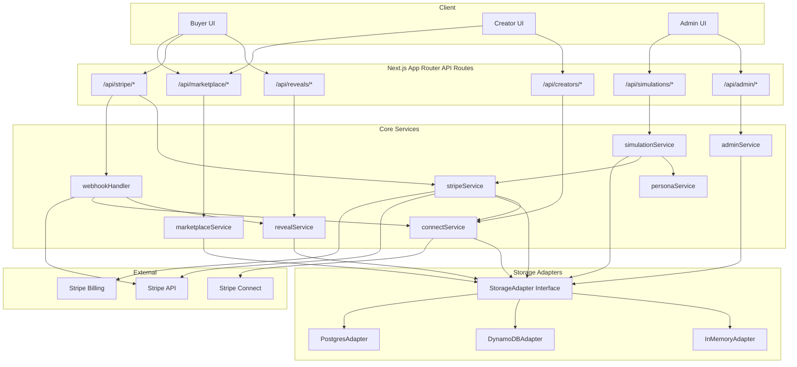
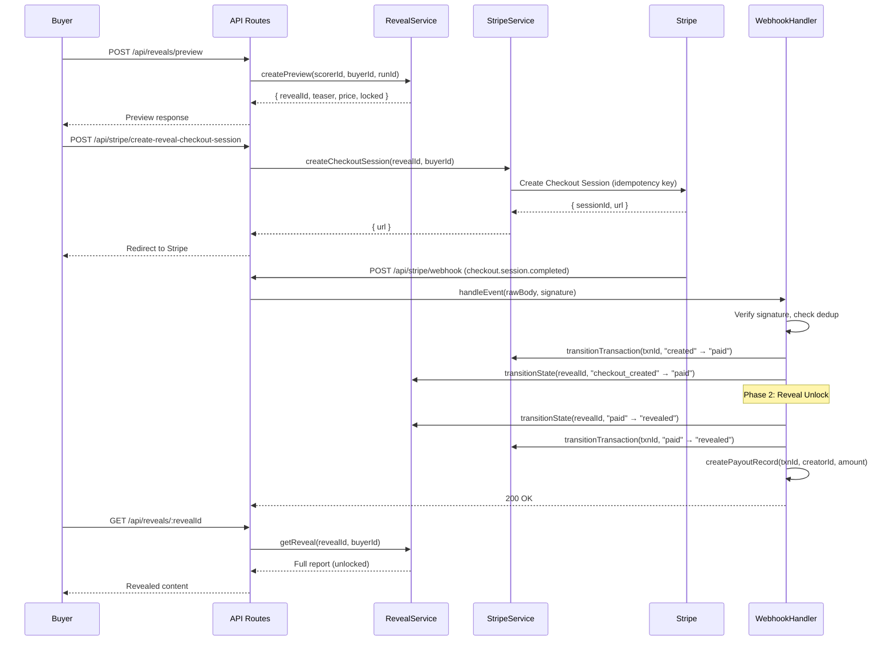
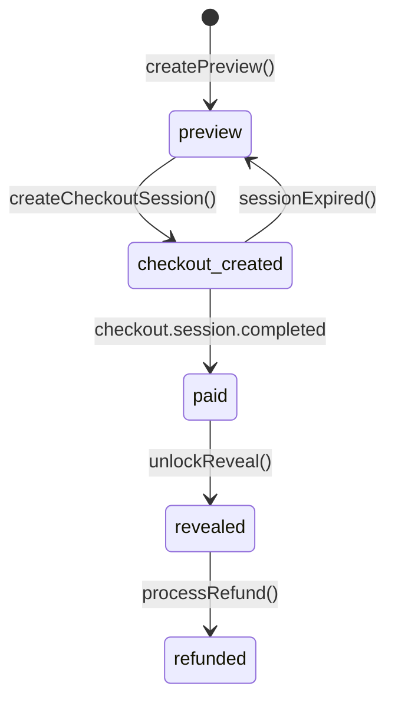
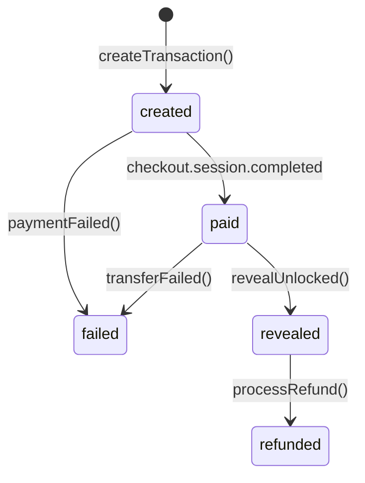
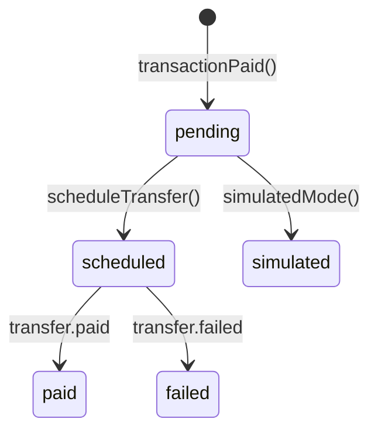
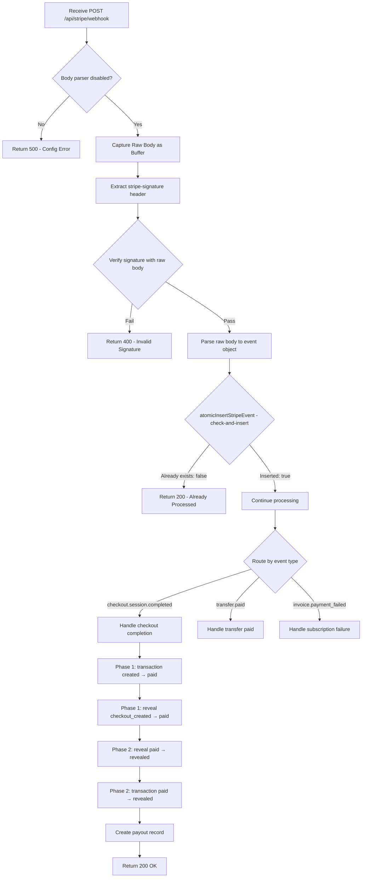
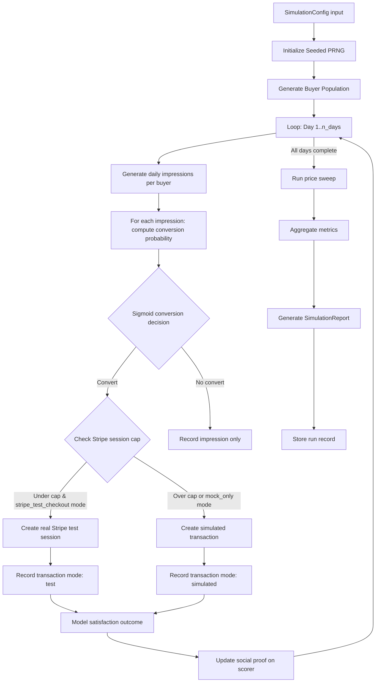
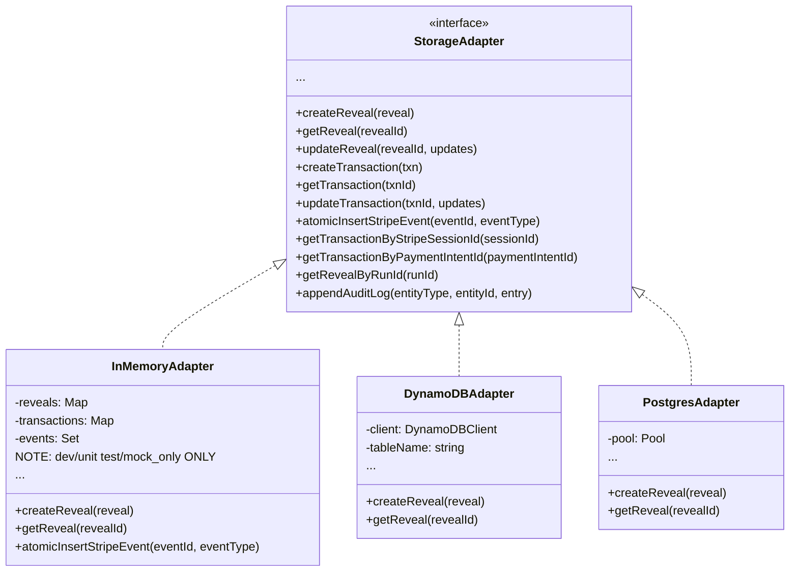

# Design Document: EvalWeaver Marketplace Stripe

## Overview

This design describes the monetization layer for EvalWeaver / Taste Compiler. The system provides:

1. **Pay-to-reveal flow** — Buyers preview scorer evaluations, pay via Stripe Checkout, and unlock full reports via webhook-driven state transitions.
2. **Taste scorer marketplace** — Creators publish quality-gated scorers; buyers browse, filter, and purchase access.
3. **Stripe Connect payouts** — Creators onboard via Connect, receive 75% revenue share through destination charges.
4. **Subscription skeleton** — Stripe Billing integration for recurring access plans.
5. **Market simulation engine** — Synthetic buyer populations, sigmoid conversion models, price sweeps, and social proof updates with deterministic replay.
6. **Mixed-mode Stripe testing** — Capped real test sessions alongside simulated internal transactions.
7. **Platform portability** — Deployable to Vercel and AWS without source changes via adapter pattern.

The MVP uses adapter-based storage: InMemoryAdapter for local dev/unit tests only, with persistent adapters (Postgres/DynamoDB) required for Stripe test checkout flows. Simulation artifacts are stored via an ArtifactAdapter (local/S3/Vercel Blob).

## Architecture

### High-Level System Diagram



### Reveal Payment Flow



## Components and Interfaces

### Service Layer

#### revealService.ts
Manages reveal lifecycle, state machine enforcement, access control, and report serialization.

```typescript
interface RevealService {
  createPreview(params: CreatePreviewParams): Promise<RevealPreview>;
  getReveal(revealId: string, buyerId: string): Promise<RevealResponse>;
  transitionState(revealId: string, targetState: RevealState, event: string): Promise<Reveal>;
  exportReport(revealId: string, buyerId: string): Promise<RevealReport>;
}
```

#### stripeService.ts (Checkout)
Creates Checkout Sessions with idempotency, manages transaction state machine, determines payment mode.

```typescript
interface StripeService {
  createRevealCheckoutSession(params: CheckoutParams): Promise<CheckoutResult>;
  createSubscriptionCheckoutSession(params: SubscriptionParams): Promise<CheckoutResult>;
  getCustomerPortalUrl(customerId: string): Promise<string>;
  transitionTransaction(txnId: string, targetState: TransactionState, event: string): Promise<Transaction>;
  determinePaymentMode(): PaymentMode;
}
```

#### webhookHandler.ts
Receives raw body, verifies signature, deduplicates, dispatches to appropriate service.

```typescript
interface WebhookHandler {
  handleEvent(rawBody: Buffer, signature: string): Promise<WebhookResult>;
}
```

#### marketplaceService.ts
Scorer CRUD, listing/search, quality gate enforcement, creator dashboard aggregation.

```typescript
interface MarketplaceService {
  listScorers(filters: ScorerFilters): Promise<PaginatedResult<ScorerListing>>;
  getScorerDetail(scorerId: string): Promise<ScorerDetail>;
  publishScorer(creatorId: string, scorer: PublishScorerParams): Promise<ScorerDetail>;
  getCreatorDashboard(creatorId: string): Promise<CreatorDashboard>;
  evaluateQualityGate(scorerId: string): Promise<QualityGateResult>;
}
```

#### connectService.ts
Stripe Connect onboarding, payout lifecycle, reconciliation.

```typescript
interface ConnectService {
  createConnectAccount(creatorId: string): Promise<OnboardingResult>;
  getOnboardingStatus(creatorId: string): Promise<ConnectStatus>;
  createPayoutRecord(txnId: string, creatorId: string, amount: number): Promise<PayoutRecord>;
  transitionPayoutStatus(payoutId: string, targetStatus: PayoutStatus, event: string): Promise<PayoutRecord>;
  reconcilePayouts(creatorId: string, startDate: Date, endDate: Date): Promise<ReconciliationResult>;
}
```

#### Stripe Connect: Destination Charges vs PayoutRecord

**Critical distinction** between the Stripe-side money movement and internal accounting:

- **Stripe destination charge** = the actual Stripe-side money movement. Configured at Checkout Session creation time via:
  - `payment_intent_data.application_fee_amount` — the 25% platform fee Stripe retains for the platform
  - `payment_intent_data.transfer_data.destination` — the creator's Connect account ID
  
  When the buyer pays, Stripe automatically splits funds: platform fee goes to the platform account, remainder transfers to the creator's Connect account. No manual transfer API call is needed.

- **PayoutRecord** = internal accounting/reconciliation object. It tracks the intended and actual state of the creator's share for:
  - Dashboard display (creator sees payout history)
  - Reconciliation (comparing internal records against Stripe transfer events)
  - Simulated mode accounting (when no real transfer occurs)
  - Audit trail

**The system MUST NOT manually create Stripe transfers on top of destination charges.** The destination charge handles the actual fund movement. The PayoutRecord is purely for internal tracking and reconciliation against Stripe's `transfer.paid` webhook events.

#### simulationService.ts
Synthetic buyer generation, conversion modeling, price sweep, mixed-mode orchestration.

```typescript
interface SimulationService {
  runMarketSimulation(config: SimulationConfig): Promise<SimulationReport>;
  generateBuyerPopulation(n: number, seed: number): BuyerPopulation;
  modelConversion(buyer: SyntheticBuyer, scorer: ScorerListing, day: number): ConversionDecision;
}
```

#### personaService.ts
Persona seeding (Neomtron SG) and management.

```typescript
interface PersonaService {
  seedNeomtronPersona(): Promise<ScorerDetail>;
  getPersona(personaId: string): Promise<PersonaProfile>;
}
```

#### adminService.ts
Metrics aggregation for observability dashboard.

```typescript
interface AdminService {
  getDashboard(userId: string): Promise<AdminDashboard>;
}
```

### Storage Adapter Interface

```typescript
interface StorageAdapter {
  // Reveals
  createReveal(reveal: Reveal): Promise<void>;
  getReveal(revealId: string): Promise<Reveal | null>;
  updateReveal(revealId: string, updates: Partial<Reveal>): Promise<void>;

  // Transactions
  createTransaction(txn: Transaction): Promise<void>;
  getTransaction(txnId: string): Promise<Transaction | null>;
  getTransactionByReveal(revealId: string): Promise<Transaction | null>;
  updateTransaction(txnId: string, updates: Partial<Transaction>): Promise<void>;

  // Scorers
  createScorer(scorer: Scorer): Promise<void>;
  getScorer(scorerId: string): Promise<Scorer | null>;
  listScorers(filters: ScorerFilters): Promise<PaginatedResult<Scorer>>;
  updateScorer(scorerId: string, updates: Partial<Scorer>): Promise<void>;

  // Creators / Connect
  createCreator(creator: Creator): Promise<void>;
  getCreator(creatorId: string): Promise<Creator | null>;
  updateCreator(creatorId: string, updates: Partial<Creator>): Promise<void>;

  // Payouts
  createPayout(payout: PayoutRecord): Promise<void>;
  getPayout(payoutId: string): Promise<PayoutRecord | null>;
  getPayoutsByCreator(creatorId: string, dateRange?: DateRange): Promise<PayoutRecord[]>;
  updatePayout(payoutId: string, updates: Partial<PayoutRecord>): Promise<void>;

  // Stripe Events (deduplication)
  atomicInsertStripeEvent(eventId: string, eventType: string): Promise<boolean>; // atomic check-and-insert; returns false if already exists (INSERT ... ON CONFLICT DO NOTHING / DynamoDB conditional put)

  // Query methods for webhook and reconciliation flows
  getTransactionByStripeSessionId(sessionId: string): Promise<Transaction | null>;
  getTransactionByPaymentIntentId(paymentIntentId: string): Promise<Transaction | null>;
  getRevealByRunId(runId: string): Promise<Reveal | null>;
  listTransactionsByCreator(creatorId: string, range?: DateRange): Promise<Transaction[]>;
  listTransactionsByScorer(scorerId: string, range?: DateRange): Promise<Transaction[]>;
  listPayoutsByTransaction(transactionId: string): Promise<PayoutRecord[]>;
  appendAuditLog(entityType: "reveal" | "transaction", entityId: string, entry: StateTransitionEntry): Promise<void>;
  updateScorerSocialProof(scorerId: string, delta: SocialProofDelta): Promise<void>;

  // Simulation
  createSimulationRun(run: SimulationRun): Promise<void>;
  getSimulationRun(runId: string): Promise<SimulationRun | null>;
  listSimulationRuns(pagination: PaginationParams): Promise<PaginatedResult<SimulationRun>>;

  // Subscriptions
  createSubscription(sub: Subscription): Promise<void>;
  getSubscription(subId: string): Promise<Subscription | null>;
  updateSubscription(subId: string, updates: Partial<Subscription>): Promise<void>;
}
```

### API Route Contracts

| Route | Method | Auth | Request Body | Response |
|-------|--------|------|-------------|----------|
| `/api/reveals/preview` | POST | buyer | `{ scorer_id, run_id }` | `{ reveal_id, teaser, price, locked_items }` |
| `/api/reveals/:revealId` | GET | buyer (owner) | — | `RevealResponse` (teaser or full) |
| `/api/reveals/:revealId/export` | GET | buyer (owner) | — | `RevealReport` JSON |
| `/api/stripe/create-reveal-checkout-session` | POST | buyer | `{ reveal_id }` | `{ url }` |
| `/api/stripe/create-subscription-checkout-session` | POST | buyer | `{ product }` | `{ url }` |
| `/api/stripe/customer-portal` | POST | buyer | — | `{ url }` |
| `/api/stripe/webhook` | POST | stripe-sig | Raw body (Buffer) | `200 OK` |
| `/api/marketplace` | GET | public | Query: `category, price_min, price_max, creator, page, limit` | `PaginatedResult<ScorerListing>` |
| `/api/marketplace/scorers/:scorerId` | GET | public | — | `ScorerDetail` |
| `/api/creators/onboard` | POST | creator | — | `{ onboarding_url, account_id }` |
| `/api/creators/connect/status` | GET | creator | — | `ConnectStatus` |
| `/api/creators/connect/reconcile` | POST | admin | `{ creator_id, start_date, end_date }` | `ReconciliationResult` |
| `/api/creators/scorers/publish` | POST | creator | `PublishScorerParams` | `ScorerDetail` |
| `/api/creator/dashboard` | GET | creator | — | `CreatorDashboard` |
| `/api/simulations/run-market` | POST | admin | `SimulationConfig` | `SimulationReport` |
| `/api/simulations/:runId` | GET | admin | — | `SimulationRun` (with report and artifact paths) |
| `/api/simulations` | GET | admin | Query: `page, limit` | `PaginatedResult<SimulationRunSummary>` |
| `/api/admin/dashboard` | GET | admin | — | `AdminDashboard` |

**Note**: `buyer_id` and `creator_id` are NEVER passed in request bodies. They are derived from the authenticated session via `AuthAdapter.requireUser()` or `AuthAdapter.requireRole()`. The `user_id` from the auth context is used as the identity for all operations.


## Data Models

### Core Entities

```typescript
// === Reveal ===
type RevealState = "preview" | "checkout_created" | "paid" | "revealed" | "refunded";

interface Reveal {
  reveal_id: string;
  buyer_id: string;
  scorer_id: string;
  run_id: string;
  status: RevealState;
  teaser: {
    strengths: string[];
    weaknesses: string[];
    locked_items: string[];
  };
  full_report: RevealReport | null; // populated after unlock
  created_at: string; // ISO 8601
  updated_at: string;
  audit_log: StateTransitionEntry[];
}

interface RevealReport {
  original_text: string;
  selected_rewrite: string;
  ranked_alternatives: string[];
  taste_score_explanation: string;
  pair_test_reasoning: string;
  hidden_scorer_summary: string;
  exportable: boolean;
}

interface StateTransitionEntry {
  from_state: string;
  to_state: string;
  event: string;
  timestamp: string;
}

// === Transaction ===
type TransactionState = "created" | "paid" | "revealed" | "refunded" | "failed";
type PaymentMode = "test" | "live" | "simulated";

interface Transaction {
  transaction_id: string;
  reveal_id: string;
  buyer_id: string;
  creator_id: string;
  scorer_id: string;
  amount_cents: number;
  currency: string; // "sgd"
  platform_fee_cents: number; // 25%
  creator_payout_cents: number; // 75%
  status: TransactionState;
  payment_mode: PaymentMode; // immutable after creation
  stripe_session_id: string | null;
  stripe_payment_intent_id: string | null;
  idempotency_key: string; // reveal_id + buyer_id
  created_at: string;
  updated_at: string;
  audit_log: StateTransitionEntry[];
}

// === Scorer ===
type ScorerVisibility = "draft" | "listed" | "flagged" | "delisted";

interface Scorer {
  scorer_id: string;
  creator_id: string;
  title: string;
  description: string;
  category: string;
  pricing_model: "pay_to_reveal" | "subscription";
  price_cents: number;
  currency: string;
  visibility: ScorerVisibility;
  platform_fee_percent: number; // 25
  creator_revenue_share_percent: number; // 75
  scoring_criteria: {
    rewards: string[];
    penalties: string[];
  };
  quality_gate: {
    test_pairs_count: number;
    heldout_accuracy: number;
    repair_rounds_count: number;
  };
  social_proof: {
    total_reveals: number;
    avg_satisfaction: number;
    repeat_buyers: number;
  };
  public_preview: string;
  created_at: string;
  updated_at: string;
}

// === Creator / Connect ===
type ConnectOnboardingState = "not_started" | "onboarding_started" | "pending_verification" | "active" | "restricted" | "disabled";

interface Creator {
  creator_id: string;
  name: string;
  stripe_account_id: string | null;
  connect_status: ConnectOnboardingState;
  market_focus: string;
  created_at: string;
  updated_at: string;
}

// === Payout ===
type PayoutStatus = "pending" | "scheduled" | "paid" | "failed" | "simulated";

interface PayoutRecord {
  payout_id: string;
  transaction_id: string;
  creator_id: string;
  amount_cents: number;
  currency: string;
  status: PayoutStatus;
  stripe_transfer_id: string | null;
  created_at: string;
  updated_at: string;
}

// === Subscription ===
interface Subscription {
  subscription_id: string;
  buyer_id: string;
  stripe_subscription_id: string;
  product: "creator_pro" | "buyer_pass" | "team_editor" | "agency_pack";
  status: string; // active, past_due, canceled, etc.
  created_at: string;
  updated_at: string;
}

// === Stripe Event Deduplication ===
interface StripeEventRecord {
  event_id: string;
  event_type: string;
  processed_at: string;
}

// === Simulation ===
type BuyerSegment = "sg_ai_founder" | "indie_hacker" | "corporate_innovator" | "investor" | "agency_lead";

interface SyntheticBuyer {
  buyer_id: string;
  segment: BuyerSegment;
  pain_intensity: number; // 0-1
  price_resistance: number; // 0-1
  trust_gap: number; // 0-1
  category_preferences: string[];
}

interface SimulationConfig {
  n_buyers: number;
  n_days: number;
  market: string;
  featured_scorers: string[];
  price_sweep_cents: number[];
  seed: number | null; // null = generate random seed
  mode: "stripe_test_checkout" | "mock_only";
  stripe_test_session_cap?: number; // default 50
}

interface SimulationRun {
  run_id: string;
  config: SimulationConfig;
  seed: number; // always stored (generated if not provided)
  status: "running" | "completed" | "failed";
  start_time: string;
  end_time: string | null;
  duration_ms: number | null;
  report: SimulationReport | null;
  artifact_paths: SimulationArtifacts | null; // populated on completion
}

interface SimulationArtifacts {
  buyer_population: string; // e.g., "simulations/{run_id}/buyer_population.csv"
  daily_impressions: string; // e.g., "simulations/{run_id}/daily_impressions.csv"
  transactions: string; // e.g., "simulations/{run_id}/transactions.csv"
  scorer_metrics: string; // e.g., "simulations/{run_id}/scorer_metrics.json"
  price_sweep: string; // e.g., "simulations/{run_id}/price_sweep.json"
  report_json: string; // e.g., "simulations/{run_id}/report.json"
}

interface SimulationReport {
  total_revenue_cents: number;
  conversion_rate: number;
  average_transaction_value_cents: number;
  revenue_by_segment: Record<BuyerSegment, number>;
  price_sweep_results: PriceSweepResult[];
  per_scorer_metrics: ScorerSimMetrics[];
  real_stripe_sessions_created: number;
  simulated_sessions_count: number;
  buyer_population_summary: Record<BuyerSegment, number>;
  seed: number;
}

interface PriceSweepResult {
  price_cents: number;
  conversion_rate: number;
  revenue_cents: number;
}

interface ScorerSimMetrics {
  scorer_id: string;
  total_reveals: number;
  revenue_cents: number;
  satisfaction_score: number;
  social_proof_delta: {
    total_reveals: number;
    avg_satisfaction: number;
    repeat_buyers: number;
  };
}

// === Admin Dashboard ===
interface AdminDashboard {
  transactions_by_mode: Record<PaymentMode, number>;
  webhook_stats: {
    total_received: number;
    successfully_processed: number;
    failed: number;
    deduplicated: number;
  };
  simulation_history: PaginatedResult<SimulationRunSummary>;
  health: {
    webhook_latency_p50_ms: number;
    webhook_latency_p95_ms: number;
    checkout_success_rate: number;
    connect_active_count: number;
  };
}

interface SimulationRunSummary {
  run_id: string;
  seed: number;
  config_summary: string;
  start_time: string;
  duration_ms: number;
  total_simulated_revenue_cents: number;
}

// === Shared ===
interface PaginatedResult<T> {
  items: T[];
  total: number;
  page: number;
  limit: number;
  has_next: boolean;
}

interface PaginationParams {
  page: number;
  limit: number;
}

interface DateRange {
  start: Date;
  end: Date;
}

interface SocialProofDelta {
  total_reveals: number;
  avg_satisfaction: number;
  repeat_buyers: number;
}
```

### State Machine Diagrams

#### Reveal State Machine



Valid transitions:
- `preview → checkout_created`
- `checkout_created → paid`
- `checkout_created → preview` (session expiry)
- `paid → revealed`
- `revealed → refunded`

#### Transaction State Machine



Valid transitions:
- `created → paid`
- `created → failed`
- `paid → revealed`
- `paid → failed`
- `revealed → refunded`

#### Payout Status Machine



Valid transitions:
- `pending → scheduled`
- `pending → simulated`
- `scheduled → paid`
- `scheduled → failed`

### Webhook Processing Pipeline



### Simulation Engine Architecture



### Conversion Model

The sigmoid conversion function takes factors:

```
P(convert) = σ(w₁·pain_intensity + w₂·creator_affinity + w₃·scorer_quality 
              + w₄·social_proof + w₅·category_fit - w₆·price_resistance - w₇·trust_gap)
```

Where σ(x) = 1 / (1 + e^(-x)) and weights are configurable per simulation.

### Storage Adapter Pattern



Adapter selection is driven by environment variable `STORAGE_ADAPTER`:
- `"memory"` → InMemoryAdapter (local dev / unit tests / mock_only simulation ONLY)
- `"dynamodb"` → DynamoDBAdapter (AWS deployment)
- `"postgres"` → PostgresAdapter (Vercel Postgres or self-hosted)

**IMPORTANT**: InMemoryAdapter is NOT suitable for `stripe_test_checkout` simulation mode because real Stripe webhooks will arrive asynchronously and require persistent state. When `MARKET_SIM_MODE="stripe_test_checkout"`, the system MUST validate at startup that the configured storage adapter is NOT InMemoryAdapter. If it is, the system fails fast with:
```
Error: stripe_test_checkout mode requires a persistent storage adapter (postgres or dynamodb). InMemoryAdapter is only valid for mock_only simulations, unit tests, and local dev.
```

### Artifact Adapter Interface

Simulation outputs and exported reports are stored via an ArtifactAdapter, selected by `ARTIFACT_ADAPTER` env var:
- `"local"` → LocalJsonArtifactAdapter (writes to `./artifacts/` directory)
- `"s3"` → S3ArtifactAdapter (AWS S3 bucket)
- `"vercel-blob"` → VercelBlobArtifactAdapter (Vercel Blob storage)

```typescript
interface ArtifactAdapter {
  writeJson(path: string, value: unknown): Promise<string>; // returns artifact URL/path
  readJson<T>(path: string): Promise<T>;
  writeCSV(path: string, rows: unknown[]): Promise<string>; // returns artifact URL/path
  listArtifacts(prefix: string): Promise<string[]>;
}
```

Implementations:
- **LocalJsonArtifactAdapter** — writes JSON/CSV files to local filesystem; suitable for dev and unit tests.
- **S3ArtifactAdapter** — writes to an S3 bucket configured via `ARTIFACT_S3_BUCKET` env var.
- **VercelBlobArtifactAdapter** — writes to Vercel Blob storage configured via `BLOB_READ_WRITE_TOKEN` env var.

### Auth Adapter Interface

Authentication and authorization are handled via an AuthAdapter that all API routes use to derive user identity. This ensures buyer_id, creator_id, and admin_id are NEVER accepted from request bodies — they are always derived from the authenticated session.

```typescript
interface AuthAdapter {
  requireUser(request: Request): Promise<AuthenticatedUser>;
  requireRole(request: Request, role: "buyer" | "creator" | "admin"): Promise<AuthenticatedUser>;
}

interface AuthenticatedUser {
  user_id: string;
  role: "buyer" | "creator" | "admin";
}
```

Implementations:
- **MockAuthAdapter** — hackathon/dev mode: reads `user_id` from `X-User-Id` header or falls back to a config default. Always succeeds for role checks unless explicitly configured to reject.
- **JWTAuthAdapter** — production mode: validates JWT from `Authorization: Bearer <token>` header, extracts `user_id` and `role` from claims. Returns 401 for missing/invalid tokens, 403 for role mismatches.

Selection driven by `AUTH_ADAPTER` env var: `"mock"` (default for dev) or `"jwt"`.

**Route Contract Update**: All routes that previously accepted `buyer_id` or `creator_id` in the request body now derive these from `AuthAdapter.requireUser()` or `AuthAdapter.requireRole()`. The authenticated user's `user_id` is used as the buyer_id/creator_id for all downstream operations.


## Correctness Properties

*A property is a characteristic or behavior that should hold true across all valid executions of a system — essentially, a formal statement about what the system should do. Properties serve as the bridge between human-readable specifications and machine-verifiable correctness guarantees.*

### Property 1: Reveal state machine enforcement

*For any* reveal in any state and any target state, the transition succeeds if and only if the (current_state, target_state) pair is in the valid transition set {(preview, checkout_created), (checkout_created, paid), (checkout_created, preview), (paid, revealed), (revealed, refunded)}. Invalid transitions are rejected with an error indicating current and attempted state.

**Validates: Requirements 18.1, 18.3**

### Property 2: Transaction state machine enforcement

*For any* transaction in any state and any target state, the transition succeeds if and only if the (current_state, target_state) pair is in the valid transition set {(created, paid), (created, failed), (paid, revealed), (paid, failed), (revealed, refunded)}. Invalid transitions are rejected with an error indicating current and attempted state.

**Validates: Requirements 18.2, 18.4**

### Property 3: Payout state machine enforcement

*For any* payout record in any state and any target state, the transition succeeds if and only if the (current_state, target_state) pair is in the valid transition set {(pending, scheduled), (pending, simulated), (scheduled, paid), (scheduled, failed)}. Invalid transitions are rejected.

**Validates: Requirements 25.2**

### Property 4: Fee split invariant

*For any* positive integer amount_cents, the platform_fee_cents shall equal Math.floor(amount_cents * 0.25) and the creator_payout_cents shall equal amount_cents - platform_fee_cents, ensuring the two always sum exactly to amount_cents.

**Validates: Requirements 2.3, 5.1, 7.3**

### Property 5: Reveal access control

*For any* reveal and any buyer_id that does not match the reveal's owner buyer_id, requesting that reveal shall return a 403 forbidden error and no report content.

**Validates: Requirements 4.3**

### Property 6: Reveal content gating by state

*For any* reveal in "preview" state, the response shall contain only teaser content with locked items hidden. *For any* reveal in "revealed" state, the response shall contain all full report fields (original_text, selected_rewrite, ranked_alternatives, taste_score_explanation, pair_test_reasoning, hidden_scorer_summary).

**Validates: Requirements 4.1, 4.2**

### Property 7: Webhook idempotency

*For any* webhook event processed successfully, processing the same event_id a second time shall produce no additional side effects (no duplicate state transitions, no duplicate payout records) and shall return a 200 response.

**Validates: Requirements 3.3, 3.4, 19.4, 19.5**

### Property 8: Webhook signature rejection

*For any* webhook request with an invalid or missing signature, the handler shall reject it with a 400 status code without performing any business logic.

**Validates: Requirements 3.1, 3.5, 17.2**

### Property 9: Checkout session idempotency

*For any* reveal_id and buyer_id combination, requesting a checkout session multiple times shall always return the same session URL (not create duplicate sessions). The idempotency key derived from (reveal_id, buyer_id) is deterministic.

**Validates: Requirements 19.1, 19.2, 19.3**

### Property 10: Payment mode determination

*For any* STRIPE_SECRET_KEY with prefix "sk_test_", the payment mode shall be "test". For prefix "sk_live_", it shall be "live". When MARKET_SIM_MODE="true", the mode shall always be "simulated" regardless of key prefix. The mode stored on a transaction record is immutable after creation.

**Validates: Requirements 5.3, 21.1, 21.2, 21.3**

### Property 11: Live key safety in non-live modes

*For any* operation where the determined Payment_Mode is "test" or "simulated", the system shall never make a Stripe API call using a key with prefix "sk_live_".

**Validates: Requirements 21.5, 11.5**

### Property 12: Mode mismatch rejection

*For any* webhook event referencing a transaction whose stored payment_mode differs from the current environment's determined mode, the handler shall reject event processing and log a warning.

**Validates: Requirements 21.4**

### Property 13: Checkout completion triggers two-phase state transitions

*For any* valid checkout.session.completed webhook event, the handler shall execute a two-phase unlock: (1) the transaction transitions from "created" to "paid" and the reveal transitions from "checkout_created" to "paid", then (2) the reveal transitions from "paid" to "revealed" and the transaction from "paid" to "revealed", and a payout record with status "pending" shall be created for the creator. Each intermediate state is traversed — no state is skipped.

**Validates: Requirements 3.2, 5.2, 25.1**

### Property 14: Quality gate enforcement

*For any* scorer where test_pairs_count < 10, OR heldout_accuracy < 0.7, OR repair_rounds_count < 1, publication shall be rejected with an error listing each unmet criterion with its current value and required threshold. Only scorers meeting ALL thresholds can achieve "listed" visibility.

**Validates: Requirements 20.1, 20.2, 20.3, 20.4, 20.5**

### Property 15: Marketplace listing visibility filter

*For any* set of scorers with mixed visibility values, the marketplace listing endpoint shall return only scorers with visibility "listed". Scorers with visibility "draft", "flagged", or "delisted" shall never appear in listing results.

**Validates: Requirements 6.1**

### Property 16: Marketplace filter correctness

*For any* filter criteria (category, price_min, price_max, creator) applied to any set of listed scorers, all returned results shall satisfy all active filter predicates simultaneously.

**Validates: Requirements 6.2**

### Property 17: Reveal report JSON round-trip

*For any* valid RevealReport object, serializing to JSON and then parsing back shall produce a structurally equivalent object (JSON.parse(JSON.stringify(report)) deep-equals the original).

**Validates: Requirements 14.1, 14.2**

### Property 18: Simulation report JSON round-trip

*For any* valid SimulationReport object, serializing to JSON and then parsing back shall produce a structurally equivalent object.

**Validates: Requirements 15.3**

### Property 19: Deterministic simulation replay

*For any* SimulationConfig and seed value, running the simulation twice with identical inputs shall produce byte-for-byte identical output artifacts (buyer population, transactions, metrics, report).

**Validates: Requirements 22.1, 22.2, 22.3**

### Property 20: Simulation seed persistence

*For any* simulation run (whether seed was provided or auto-generated), the seed shall be stored in both the run record and the output report, and replaying with that seed shall reproduce the run.

**Validates: Requirements 22.4, 22.5**

### Property 21: Stripe test session cap enforcement

*For any* simulation run in "stripe_test_checkout" mode, the count of real Stripe test sessions created shall never exceed the configured Stripe_Test_Session_Cap. All conversions after the cap is reached shall be processed as simulated transactions.

**Validates: Requirements 23.1, 23.3, 23.4**

### Property 22: Session accounting invariant

*For any* completed simulation run, real_stripe_sessions_created + simulated_sessions_count shall equal the total number of converted transactions in the simulation.

**Validates: Requirements 23.5, 11.4**

### Property 23: Sigmoid conversion bounded output

*For any* set of conversion factors (pain_intensity, creator_affinity, scorer_quality, social_proof, category_fit, price_resistance, trust_gap), the conversion probability shall be strictly in the range (0, 1) and monotonically increasing with positive factors and decreasing with negative factors (price_resistance, trust_gap).

**Validates: Requirements 10.2**

### Property 24: Buyer population size invariant

*For any* SimulationConfig with n_buyers = N, the generated buyer population shall contain exactly N buyers, each assigned to a valid BuyerSegment.

**Validates: Requirements 10.1**

### Property 25: Social proof monotonic increase on reveals

*For any* successful simulated reveal, the scorer's social_proof.total_reveals shall increase by exactly 1 compared to its value before the reveal.

**Validates: Requirements 10.5**

### Property 26: Simulated payout for non-active creators

*For any* transaction where the Payment_Mode is "simulated" OR the creator's Connect account status is not "active", the payout record shall have status "simulated" and no Stripe transfer shall be initiated.

**Validates: Requirements 8.4, 25.3**

### Property 27: Reconciliation discrepancy detection

*For any* creator and time range where the sum of "paid" payout records differs from the sum of Stripe transfer records by more than 1%, the reconciliation shall flag the discrepancy and report affected transaction IDs.

**Validates: Requirements 25.5, 25.6**

### Property 28: Audit log growth on state transitions

*For any* successful state transition on a reveal or transaction, the audit_log array shall grow by exactly one entry containing the from_state, to_state, triggering event, and a valid ISO 8601 timestamp.

**Validates: Requirements 18.5, 18.6**

### Property 29: Invalid scorer returns 404

*For any* scorer_id that does not exist in the store or has visibility other than "listed", requesting a preview shall return a 404 error.

**Validates: Requirements 1.4**

### Property 30: Export denied for non-revealed reports

*For any* reveal with status other than "revealed", requesting an export shall return a 403 status.

**Validates: Requirements 14.3**

### Property 31: Admin access control

*For any* user without admin role, requesting the admin dashboard shall return a 403 forbidden error.

**Validates: Requirements 24.5**

### Property 32: Dashboard metrics consistency

*For any* set of transactions for a creator, the dashboard's total_revenue shall equal the sum of individual transaction creator_payout_cents, and total_transactions shall equal the count of transaction records.

**Validates: Requirements 13.1, 13.2**

### Property 33: Webhook stats consistency

*For any* set of webhook events, total_received shall equal successfully_processed + failed + deduplicated.

**Validates: Requirements 24.2**

### Property 34: Environment validation fail-fast

*For any* startup configuration missing one or more required environment variables, the system shall throw an error listing all missing variable names before accepting any requests.

**Validates: Requirements 16.5**

### Property 35: Checkout refuses paid/invalid reveals

*For any* reveal_id that does not exist or has a status other than "preview" or "checkout_created", creating a checkout session shall return an error.

**Validates: Requirements 2.5**

## Error Handling

### Error Categories

| Category | HTTP Status | Handling Strategy |
|----------|------------|-------------------|
| Validation errors (missing fields, invalid formats) | 400 | Return structured error with field-level details |
| Authentication failures | 401 | Return generic "unauthorized" message |
| Authorization failures (wrong buyer, non-admin) | 403 | Return "forbidden" without leaking resource details |
| Resource not found | 404 | Return "not found" with resource type |
| State machine violations | 409 | Return current state and attempted transition |
| Webhook signature failure | 400 | Log full details, return minimal error to Stripe |
| Raw body missing | 500 | Log configuration error, alert ops |
| Stripe API errors | 502 | Wrap Stripe error, retry if idempotent |
| Mode mismatch | 409 | Log warning, reject processing |
| Env var missing at startup | — | Throw with list of missing vars, prevent boot |

### Error Response Format

```typescript
interface ErrorResponse {
  error: {
    code: string; // machine-readable: "INVALID_STATE_TRANSITION", "QUALITY_GATE_FAILED", etc.
    message: string; // human-readable description
    details?: Record<string, unknown>; // additional context (e.g., missing fields, current state)
  };
}
```

### Retry Strategy

- **Webhook processing**: Stripe retries failed webhooks automatically. The system relies on idempotency to handle replays safely.
- **Checkout session creation**: Idempotency key ensures retries by buyers produce the same session.
- **Stripe API calls**: Wrap in try/catch, log failures, return appropriate error to caller. No automatic retry within a single request (Stripe handles network-level retries).
- **Simulation failures**: Mark run as "failed", preserve partial state for debugging. Seed ensures replay capability.

### Circuit Breaker Pattern (Future)

For production deployment, add circuit breakers around:
- Stripe API calls (detect sustained 5xx responses)
- Storage adapter calls (detect database connectivity issues)

## Failure Handling and Recovery

| Failure Scenario | Behavior | Recovery |
|-----------------|----------|----------|
| Stripe session creation fails | Return error to buyer, do NOT create a transaction record | Buyer retries; idempotency key prevents duplicates on Stripe side |
| Webhook duplicate arrives | `atomicInsertStripeEvent` returns `false` → return 200 immediately, no side effects | N/A — safely deduplicated |
| Webhook arrives before transaction record exists | Log warning with session_id and event_id, return 200 to Stripe | Rely on eventual consistency: buyer's next poll triggers state sync, or Stripe retries webhook |
| Connect account inactive at checkout time | Use simulated payout fallback (PayoutRecord with status "simulated"), still create real Checkout Session with destination charge omitted | Creator completes onboarding later; reconciliation catches pending payouts |
| Payment mode mismatch on webhook | Reject event processing, log warning with transaction_id, stored mode, and current mode | Manual investigation via admin dashboard |
| Simulation exceeds test session cap | Switch remaining conversions to simulated mode transparently | Report clearly shows real vs simulated split |
| Storage adapter write fails | Return 500 to caller, do NOT leave partial state (no payout without transaction update) | Caller retries; idempotency ensures safe replay |
| Quality gate fails | Return 400 with detailed criteria report (each criterion, current value, threshold) | Creator improves scorer and re-submits |
| Report export requested before unlock | Return 403 with message indicating reveal must be in "revealed" state | Buyer completes payment first |

### Partial Failure Ordering

For the checkout.session.completed handler, operations execute in strict order. If any step fails, subsequent steps are skipped:

1. `atomicInsertStripeEvent` — dedup gate
2. `transitionTransaction(created → paid)` — payment confirmation
3. `transitionReveal(checkout_created → paid)` — reveal payment confirmed
4. `transitionReveal(paid → revealed)` — unlock
5. `transitionTransaction(paid → revealed)` — reveal completion
6. `createPayoutRecord` — accounting

If step 4-6 fails after step 2-3 succeeds, the system is in a "paid but not revealed" state. The buyer can trigger a manual unlock retry via `GET /api/reveals/:revealId` which checks for paid state and completes the reveal transition.

## Test Plan / Correctness Verification

This section maps specific test scenarios to requirements for verification traceability.

| Test Scenario | Type | Validates Requirement(s) | Key Assertion |
|--------------|------|--------------------------|---------------|
| State-machine invalid transitions | Property | Req 18 | All (state, target) pairs not in valid set are rejected |
| Idempotent checkout creation | Property | Req 19 | Same (reveal_id, buyer_id) always returns same session URL |
| Duplicate webhook processing | Property | Req 19, 3 | Second processing of same event_id produces no side effects |
| Raw-body webhook verification | Unit | Req 17 | Signature verified against raw bytes, not re-serialized JSON |
| Payment-mode isolation | Property | Req 21 | sk_test_ → "test", sk_live_ → "live", SIM_MODE → "simulated"; never call live keys in test/sim |
| Deterministic simulation replay | Property | Req 22 | Same config + seed → byte-identical outputs |
| Quality-gate rejection | Property | Req 20 | Scorers below any threshold are rejected with specific failure details |
| Access-control 403 cases | Property | Req 4, 14, 24 | Non-owner buyer gets 403; non-admin gets 403 on admin routes; unexported reveal gets 403 |
| Round-trip JSON serialization | Property | Req 14, 15 | `JSON.parse(JSON.stringify(obj))` deep-equals original for RevealReport and SimulationReport |
| Fee split invariant | Property | Req 5, 7 | platform_fee + creator_payout == amount_cents for all positive integers |
| Stripe test session cap | Property | Req 23 | real_sessions ≤ cap; real + simulated == total conversions |
| Payout status accounting | Property | Req 25 | Simulated/inactive-creator → payout status "simulated"; paid transactions → payout "pending" |
| Atomic event dedup under concurrency | Integration | Req 19 | Concurrent inserts of same event_id: exactly one succeeds, others return false |

## Testing Strategy

### Dual Testing Approach

This system uses both unit tests and property-based tests for comprehensive coverage:

- **Unit tests**: Verify specific examples, edge cases, integration points, and the Neomtron persona seeding (Requirements 12.1–12.5).
- **Property-based tests**: Verify universal correctness properties across randomized inputs using a PBT library.

### Property-Based Testing Configuration

- **Library**: [fast-check](https://github.com/dubzzz/fast-check) (TypeScript/JavaScript PBT library)
- **Minimum iterations**: 100 per property test
- **Each property test references its design property** with tag format:
  `// Feature: evalweaver-marketplace-stripe, Property {N}: {title}`
- **Each correctness property is implemented by a single property-based test**

### Test Organization

```
tests/
├── properties/
│   ├── reveal-state-machine.property.ts      # Properties 1, 28
│   ├── transaction-state-machine.property.ts # Properties 2, 28
│   ├── payout-state-machine.property.ts      # Property 3
│   ├── fee-split.property.ts                 # Property 4
│   ├── access-control.property.ts            # Properties 5, 6, 30, 31
│   ├── webhook-idempotency.property.ts       # Properties 7, 8
│   ├── checkout-idempotency.property.ts      # Properties 9, 35
│   ├── payment-mode.property.ts              # Properties 10, 11, 12
│   ├── checkout-completion.property.ts       # Property 13
│   ├── quality-gate.property.ts              # Property 14
│   ├── marketplace-listing.property.ts       # Properties 15, 16
│   ├── json-roundtrip.property.ts            # Properties 17, 18
│   ├── simulation-replay.property.ts         # Properties 19, 20
│   ├── session-cap.property.ts              # Properties 21, 22
│   ├── conversion-model.property.ts          # Properties 23, 24, 25
│   ├── payout-simulated.property.ts          # Property 26
│   ├── reconciliation.property.ts            # Property 27
│   ├── dashboard-metrics.property.ts         # Properties 32, 33
│   └── env-validation.property.ts            # Property 34
├── unit/
│   ├── reveal-service.test.ts
│   ├── stripe-service.test.ts
│   ├── webhook-handler.test.ts
│   ├── marketplace-service.test.ts
│   ├── connect-service.test.ts
│   ├── simulation-service.test.ts
│   ├── persona-service.test.ts               # Neomtron seeding examples
│   └── admin-service.test.ts
└── integration/
    ├── webhook-pipeline.test.ts
    └── storage-adapters.test.ts
```

### Unit Test Focus Areas

- Neomtron persona seeding produces exact expected values (Req 12.1–12.5)
- Stripe test session cap defaults to 50 (Req 23.2)
- Specific webhook event routing (checkout.session.completed, transfer.paid, invoice.payment_failed)
- Raw body unavailable returns 500 (Req 17.3)
- Connect onboarding state enumeration (Req 8.2)
- Subscription product catalog validation (Req 9.1)
- 500-buyer / 30-day simulation capacity (Req 10.4)

### Property Test Generators

Key generators needed for fast-check:

```typescript
// Arbitrary reveal in any valid state
const arbReveal: fc.Arbitrary<Reveal>
// Arbitrary transaction in any valid state  
const arbTransaction: fc.Arbitrary<Transaction>
// Arbitrary positive integer cents amount
const arbAmountCents: fc.Arbitrary<number>  // fc.integer({ min: 1, max: 1_000_000 })
// Arbitrary scorer meeting/not meeting quality gate
const arbScorer: fc.Arbitrary<Scorer>
// Arbitrary simulation config with seed
const arbSimConfig: fc.Arbitrary<SimulationConfig>
// Arbitrary buyer with segment and factors
const arbSyntheticBuyer: fc.Arbitrary<SyntheticBuyer>
// Arbitrary conversion factors (all 0-1 range)
const arbConversionFactors: fc.Arbitrary<ConversionFactors>
// Arbitrary payout record set for reconciliation
const arbPayoutSet: fc.Arbitrary<PayoutRecord[]>
```

### Integration Test Strategy

- Webhook pipeline: end-to-end from raw body → signature verify → dedup → state transition
- Storage adapters: verify InMemoryAdapter and (in CI with real services) DynamoDB/Postgres adapters satisfy the same interface contract
- Mixed-mode simulation: verify cap enforcement with mocked Stripe client

