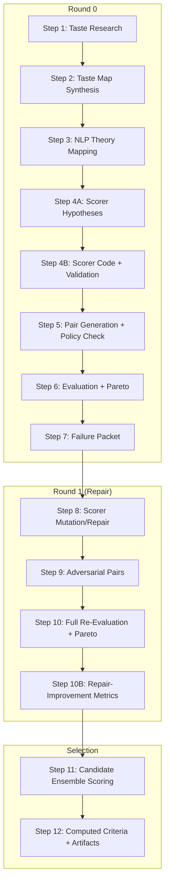
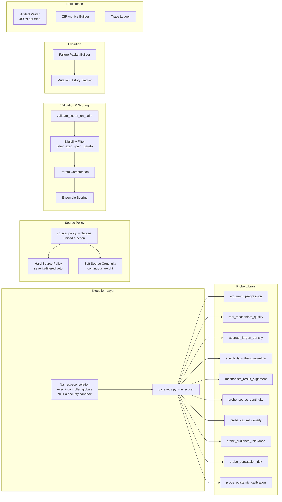

# Design Document: EvalWeaver v5.1 Reasoning Core

## Overview

EvalWeaver v5.1 is a 12-step automated pipeline that discovers, validates, and evolves quality scorers for subjective text improvement goals. Given a goal (e.g., "make this more persuasive") and an anchor text, it:

1. Gathers linguistic/psychological research (mocked/seeded for v5.1)
2. Synthesizes a structured Taste Map
3. Maps taste concepts to NLP probes
4. Generates scorer hypotheses (theory-first)
5. Implements and validates scorer code on pairs
6. Generates evaluation pairs with source-policy enforcement
7. Evaluates scorers, computes Pareto frontier
8. Analyzes failures, generates mutation/adversarial instructions
9. Evolves scorers via repair loop
10. Generates adversarial pairs targeting weaknesses
11. Re-evaluates combined scorer pool on expanded pair suite
12. Selects best candidate via ensemble scoring

v5.1 fixes nine issues grouped into eight categories:
- **F1+F2**: Pair-based validation replaces single-anchor spread testing
- **F3**: Unified `source_policy_violations()` for pair and candidate validation
- **F4**: Hard/soft source policy split (binary veto vs continuous weight)
- **F5**: Three-tier validity vocabulary with eligibility filter before Pareto
- **F6**: New probes including `mechanism_result_alignment`
- **F7**: Explicit `fake_mechanism` pair type
- **F8**: Mutation instruction history tracking
- **F9**: All spec criteria computed from artifacts, not hardcoded

The pipeline runs as a single Python script with no external service dependencies. All scorers execute in a namespace-isolated `exec()` environment — this provides namespace isolation and exception catching but is NOT a security sandbox. It is not safe for untrusted arbitrary code. A move to a proper AWS sandbox for execution is planned for the future but is not part of the current design. Output is a set of JSON artifacts plus a ZIP archive.

## Architecture

### Pipeline Flow Diagram



### Component Diagram



## Components and Interfaces

### Module Structure

```
evalweaver_v5_1_reasoning_core.py
├── Configuration & Constants
│   ├── OUT (output directory, env-configurable with fallback)
│   ├── Pipeline parameters (N_ROUNDS, N_INIT_SCORERS, etc.)
│   └── DEFAULT_SOURCE_POLICY
│
├── Utility Functions
│   ├── log(stage, msg, status)
│   ├── save(name, obj)
│   └── seeded_shuffle(lst, seed)
│
├── Namespace Isolation (NOT a security boundary)
│   ├── _py_ns (controlled globals dict)
│   ├── py_exec(code, label) → {ok, error?}
│   └── py_run_scorer(code, text, anchor) → {ok, value, error?}
│
├── Source Policy Module
│   ├── source_policy_violations(text, anchor, policy, *, role, pair_type) → List[ViolationObj]
│   ├── hard_source_policy_violated(text, anchor, policy, *, role, pair_type) → bool
│   ├── probe_source_continuity(text, anchor) → float [0,1]
│   └── validate_pair_source_policy(pair) → {valid, errors, pair_id}
│
├── Probe Library (loaded into _py_ns)
│   ├── probe_argument_progression(text) → float [0,1]
│   ├── probe_real_mechanism_quality(text) → float [0,1]
│   ├── probe_abstract_jargon_density(text) → float [0,1]
│   ├── probe_specificity_without_invention(text, anchor) → float [0,1]
│   ├── probe_mechanism_result_alignment(text) → float [0,1]
│   ├── probe_causal_density(text) → float [0,1]
│   ├── probe_audience_relevance(text) → float [0,1]
│   ├── probe_persuasion_risk(text) → float [0,1]
│   └── probe_epistemic_calibration(text) → float [0,1]
│
├── Validation & Evaluation
│   ├── validate_scorer_on_pairs(code, pairs) → ValidationResult
│   ├── eval_scorer(sid, code, pairs) → List[EvalRow]
│   ├── compute_summary(sid, rows, validation, hyps, round) → ScorerSummary
│   └── is_eligible_for_pareto(summary) → (bool, reason)
│
├── Pareto & Ensemble
│   ├── compute_pareto(summaries) → List[ScorerSummary]
│   └── score_candidates(candidates, ensemble, anchor) → List[ScoredCandidate]
│
├── Failure Analysis & Evolution
│   ├── build_failure_packet(round, summaries, evals, pairs, pareto, prior) → FailurePacket
│   └── compute_repair_improvement_metrics(r0_best, r1_scorers, heldout_sets) → RepairMetrics
│
├── Criteria & Output
│   ├── spec_criterion(name, value, threshold, warn_only) → CriterionResult
│   ├── compute_all_criteria() → List[CriterionResult]
│   └── build_zip_archive(out_dir) → path
│
└── Pipeline Steps 1–12 (sequential execution)
```

### Key Function Signatures

```python
# ─── Source Policy (v5.1 unified function) ───────────────────────
def source_policy_violations(text, anchor, policy=None, *, role="candidate", pair_type=None) -> list[dict]:
    """
    Unified source policy check. Returns list of violation objects.
    Each: {"violation_type": str, "evidence": str, "severity": "hard"|"soft"}
    
    Parameters:
      text:      The text to check for violations
      anchor:    The reference/original text
      policy:    Optional policy dict overriding DEFAULT_SOURCE_POLICY
      role:      One of "positive_pair", "negative_pair", "candidate"
                 Controls which checks apply (e.g., negative_pair in
                 specificity_trap/source_drift pairs may allow invented numbers)
      pair_type: Optional pair type for policy nuance. Supported values:
                 "source_drift", "specificity_trap", "adversarial_negatives"
                 Allows role-aware relaxation (e.g., negatives in source_drift
                 pairs are expected to have violations — don't flag them as errors)
    
    Canonical violation type strings (use EXACTLY these across code, JSON, tests, reports):
      - invented_numeric_digit
      - invented_numeric_word
      - invented_time_or_quantity_claim
      - invented_named_entity
      - invented_customer_or_company_claim
      - invented_award_or_certification_claim
      - guarantee_claim
    
    Used by BOTH scorer veto path AND candidate validation path.
    """

def hard_source_policy_violated(text, anchor, policy=None, *, role="candidate", pair_type=None) -> bool:
    """
    Returns True when ANY violation with severity == "hard" exists.
    This filters by severity field, NOT by list non-emptiness.
    
    Implementation:
        return any(
            v.get("severity") == "hard"
            for v in source_policy_violations(text, anchor, policy, role=role, pair_type=pair_type)
        )
    """
    return any(
        v.get("severity") == "hard"
        for v in source_policy_violations(text, anchor, policy, role=role, pair_type=pair_type)
    )

# ─── Three-Tier Validity ─────────────────────────────────────────
def classify_scorer_validity(validation_result: dict, eval_summary: dict) -> str:
    """
    Returns one of: "not_valid", "execution_valid", "pair_quality_valid", "pareto_eligible"
    
    execution_valid: loads, runs, bounded [0,1], non-constant (spread >= 0.001)
    pair_quality_valid: execution_valid + accuracy > 0.5 + margin > 0
    pareto_eligible: pair_quality_valid + full eligibility filter pass
    """

def is_eligible_for_pareto(s: dict) -> tuple[bool, str]:
    """
    Full eligibility filter:
      - execution_valid (valid == True)
      - exec_error_rate == 0
      - score_spread >= 0.02
      - train_margin > 0
      - test_margin > 0
      - train_accuracy >= 0.50
      - test_accuracy >= 0.50
    """
```

```python
# ─── Probe: mechanism_result_alignment (NEW in v5.1) ─────────────
def probe_mechanism_result_alignment(text: str) -> float:
    """
    Extracts mechanism-ish and result-ish clauses from text.
    Rewards concrete action/object terms in both clauses.
    Penalizes jargon-only mechanism/result bridges.
    Returns [0.0, 1.0].
    
    Does NOT require shared verbs between mechanism and result.
    
    Mechanism clause: text following "by ", "through ", "using "
    Result clause: text following "so ", "which means", "enabling", "letting"
    
    Scoring dimensions:
      +points for concrete action verb in mechanism clause
      +points for concrete object noun in mechanism clause
      +points for concrete consequence/action verb in result clause
      +points for concrete operational noun in result clause
      -penalty for jargon-only mechanism clause (no concrete domain nouns or action verbs)
      -penalty for jargon-only result clause (no concrete domain nouns or action verbs)
      -penalty for missing mechanism clause entirely
      -penalty for missing result clause entirely
    
    Test examples (documented acceptance tests):
      - "surfaces stuck decisions so one async review unblocks the team"
        MUST beat "advanced platform improves collaboration"
      - "flags security-boundary code changes so reviewers focus where it matters"
        MUST beat "intelligent engine optimises workflow seamlessly"
    """

# ─── Repair Improvement Metrics (NEW in v5.1) ────────────────────
def compute_repair_improvement_metrics(
    r0_best_sid: str,
    r1_scorer_ids: list[str],
    all_code: dict[str, str],
    original_heldout: list[dict],
    adversarial_heldout: list[dict],
    new_heldout: list[dict],
    final_heldout: list[dict],
) -> dict:
    """
    Compares old vs new scorers across identical subsets.
    
    Artifact: step10_repair_improvement_metrics.json
    
    Returns:
    {
      "subsets": {
        "common_heldout": {
          "best_old_by_margin": {...},
          "best_new_by_margin": {...},
          "best_old_by_accuracy": {...},
          "best_new_by_accuracy": {...},
          "margin_delta_new_minus_old": float,
          "accuracy_delta_new_minus_old": float
        },
        "new_heldout": {...},
        "adversarial_train": {...},
        "final_heldout": {...}
      },
      "new_scorer_enters_pareto": bool,
      "new_scorer_beats_old_best_on_common_heldout": bool,
      "new_scorer_beats_old_best_on_new_heldout": bool,
      "new_scorer_beats_old_best_on_final_heldout": bool,
      "new_scorer_share_of_eligible_ensemble": float,
      "overall_improvement_claim_supported": bool,
      "honest_repair_summary": str
    }
    
    The final report MUST NOT say "evolution improved the scorer" unless
    these metrics support it (overall_improvement_claim_supported == True).
    """

# ─── Named Entity Detection Guardrails ───────────────────────────
def detect_named_entities(text: str, anchor: str) -> list[str]:
    """
    Detects new named entities in text not present in anchor.
    
    CRITICAL: Naive capitalization is NOT enough for named entity detection.
    
    Avoid false positives from:
      - Sentence-initial common words (capitalized due to position, not entity status)
      - Allowed domain abbreviations: AI, SQL, API, BI, HR, VC, P&L
      - Product names already present in anchor
      - Generic role/domain nouns (e.g., "Manager", "Director" as role titles)
    
    Strictly flag:
      - New customer names (not in anchor)
      - New company names (not in anchor)
      - Fortune 500 / enterprise-client claims
      - Award-winning / certified / compliant claims
      - SOC2 / ISO / HIPAA unless present in anchor
    """

# ─── Artifact Persistence ────────────────────────────────────────
def resolve_output_directory() -> str:
    """
    Priority:
      1. EVALWEAVER_OUTPUT_DIR env var
      2. ./ew_v51_outputs (current directory)
      3. tempfile.mkdtemp() as final fallback
    
    Creates directory if needed. Logs warning on fallback.
    Never crashes on missing mount.
    """
```

## Data Models

### Taste Map
```python
TasteMap = {
    "goal": str,                          # e.g., "persuasive"
    "rewards": [RewardConcept],           # ≥3 required
    "punishes": [PunishConcept],          # ≥1 required
    "preserves": [PreserveConcept],       # ≥1 required
    "key_tensions": [str],                # Competing signal pairs
    "scorer_hypothesis_seeds": [str],     # Informs initial scorer design
}

RewardConcept = {
    "concept": str,
    "description": str,
    "research_basis": str,
    "measurable_proxy_ideas": [str],
}
```

### Scorer Hypothesis
```python
ScorerHypothesis = {
    "scorer_id": str,                     # e.g., "S_r0_001"
    "lineage": str,                       # "initial" | "mutation" | "blind_node_repair" | "recombination" | "novel_composition"
    "hypothesis": str,                    # Theory of how probes combine
    "research_basis": [str],
    "taste_map_basis": [str],             # Concepts from TasteMap
    "expected_failure_mode": str,
    "constants_and_thresholds": [{"name": str, "value": float, "reason": str}],
}
```

### Pair
```python
Pair = {
    "pair_id": str,                       # e.g., "R0_P01", "R1_A03", "R0_T01"
    "anchor": str,                        # Original text
    "positive": str,                      # Higher-quality rewrite
    "negative": str,                      # Lower-quality rewrite
    "pair_type": str,                     # "hype_trap" | "fake_mechanism" | "specificity_trap" | "subtle_quality_gap" | "source_drift"
    "source_policy": dict,                # Policy configuration for this pair
    "label_contract": str,                # Why positive > negative
    "intended_trap": str,                 # What makes the negative deceptive
    "split": str,                         # "train" | "test" | "adversarial"
    "frozen": bool,                       # True for heldout pairs (anti-leakage)
    # Adversarial pairs additionally have:
    "attacks_scorer_ids": [str],          # Optional
    "attacked_shortcut": str,             # Optional
}
```

### Source Policy Violation (Canonical Taxonomy)

The following violation type strings are the CANONICAL taxonomy. Use these EXACT strings across all code, JSON artifacts, tests, and reports:

```python
VIOLATION_TYPES = [
    "invented_numeric_digit",
    "invented_numeric_word",
    "invented_time_or_quantity_claim",
    "invented_named_entity",
    "invented_customer_or_company_claim",
    "invented_award_or_certification_claim",
    "guarantee_claim",
]

Violation = {
    "violation_type": str,                # One of VIOLATION_TYPES above (EXACT strings)
    "evidence": str,                      # The specific text matched
    "severity": str,                      # "hard" or "soft"
}
```

### Scorer Evaluation Summary (Three-Tier Validity)
```python
ScorerSummary = {
    "scorer_id": str,
    "hypothesis": str,
    "lineage": str,
    "generation_round": int,
    # ─── Three-Tier Validity Fields ───────────────────────────────
    "execution_valid": bool,              # loads, runs, bounded, nonconstant spread
    "pair_quality_valid": bool,           # execution_valid AND pair_validation_accuracy >= 0.50 AND pair_validation_margin > 0
    "pareto_eligible": bool,              # passes full train/test/margin/spread eligibility filter
    "pareto_ineligible_reason": str,      # reason string if not pareto_eligible, else ""
    "valid": bool,                        # DEPRECATED alias for execution_valid only
    # ─── Validation Metrics ───────────────────────────────────────
    "validation_reason": str,
    "pair_validation_accuracy": float,
    "pair_validation_margin": float,
    "pair_validation_spread": float,
    # ─── Evaluation Metrics ───────────────────────────────────────
    "train_accuracy": float,
    "train_margin": float,
    "test_accuracy": float,
    "test_margin": float,
    "adversarial_accuracy": float | None,
    "adversarial_margin": float | None,
    "score_spread": float,
    "exec_error_rate": float,
    "pair_type_accuracy": dict[str, float],
    "robustness_warning": str,
}
```

Three-tier validity definitions:
- **`execution_valid`**: The scorer loads, runs without error on all validation pairs, outputs are bounded in [0.0, 1.0], and outputs are non-constant across pairs (spread ≥ 0.001).
- **`pair_quality_valid`**: `execution_valid` AND `pair_validation_accuracy >= 0.50` AND `pair_validation_margin > 0`.
- **`pareto_eligible`**: Passes the full eligibility filter criteria (positive margins, minimum accuracy, minimum spread). See `is_eligible_for_pareto()`.

The `valid` field is retained as a deprecated alias for `execution_valid` only. New code should use the explicit boolean fields.

### Failure Packet
```python
FailurePacket = {
    "round_idx": int,
    "top_scorers": [TopScorerInfo],
    "failed_visible_pairs": [FailedPairInfo],
    "low_margin_visible_pairs": [LowMarginInfo],
    "failed_pair_type_counts": dict[str, int],
    "score_collapse_warnings": [str],
    "heldout_aggregate_only": {           # Anti-leakage: no raw text
        "heldout_accuracy_by_scorer": dict[str, float],
        "heldout_margin_by_scorer": dict[str, float],
        "heldout_failures_by_pair_type": dict[str, int],
    },
    "scorer_weakness_summary": str,
    "mutation_instructions": [str],       # New, excluding prior-applied
    "adversarial_pair_instructions": [str],
    "applied_from_prior_round": [str],    # F8: tracked history
}
```

### Repair-Improvement Metrics (NEW v5.1)
```python
RepairImprovementMetrics = {
    "subsets": {
        "common_heldout": {
            "best_old_by_margin": dict,       # {scorer_id, margin, accuracy}
            "best_new_by_margin": dict,       # {scorer_id, margin, accuracy}
            "best_old_by_accuracy": dict,     # {scorer_id, margin, accuracy}
            "best_new_by_accuracy": dict,     # {scorer_id, margin, accuracy}
            "margin_delta_new_minus_old": float,
            "accuracy_delta_new_minus_old": float,
        },
        "new_heldout": {
            # Same structure as common_heldout
        },
        "adversarial_train": {
            # Same structure as common_heldout
        },
        "final_heldout": {
            # Same structure as common_heldout
        },
    },
    "new_scorer_enters_pareto": bool,
    "new_scorer_beats_old_best_on_common_heldout": bool,
    "new_scorer_beats_old_best_on_new_heldout": bool,
    "new_scorer_beats_old_best_on_final_heldout": bool,
    "new_scorer_share_of_eligible_ensemble": float,
    "overall_improvement_claim_supported": bool,
    "honest_repair_summary": str,         # Human-readable summary of what improved (or didn't)
}
```

The final report MUST NOT say "evolution improved the scorer" unless `overall_improvement_claim_supported` is True based on these comparative metrics.

### Scored Candidate
```python
ScoredCandidate = {
    "candidate_id": str,
    "strategy": str,
    "text": str,
    "raw_scores": dict[str, float],       # Per-scorer raw scores
    "norm_scores": dict[str, float],      # Per-scorer normalized scores
    "raw_mean_score": float,              # Unnormalized mean across scorers
    "normalized_ensemble_score": float,   # Min-max normalized then averaged
    "ensemble_score": float,              # Final score used for ranking (= normalized_ensemble_score)
    "policy_violations": [Violation],     # From source_policy_violations()
    "policy_ok": bool,                    # False if ANY hard violation exists (severity == "hard")
}
```

`policy_ok` semantics: `policy_ok` is False if and only if any violation in `policy_violations` has `severity == "hard"`. Soft violations do not set `policy_ok` to False. This is consistent with `hard_source_policy_violated()` which filters by severity, not by list non-emptiness.

Documented acceptance tests for candidate scoring:
- **C004** (hype-control baseline) MUST have `policy_ok = false`
- **C004** MUST include at least one hard violation in `policy_violations`
- **C004** MUST have `raw_mean_score` of zero or near-zero (< 0.05)
- **C002** (audience-pain candidate) MUST remain above zero (> 0.05 normalized), proving soft source continuity still works and does not zero legitimate rephrasing

### Computed Criterion
```python
CriterionResult = {
    "criterion": str,
    "status": str,                        # "pass" | "warning" | "fail"
    "computed_value": Any,
    "threshold": str,
}
```

## Correctness Properties

*A property is a characteristic or behavior that should hold true across all valid executions of a system—essentially, a formal statement about what the system should do. Properties serve as the bridge between human-readable specifications and machine-verifiable correctness guarantees.*

### Property 1: Scorer output clamping invariant

*For any* scorer code and any text/anchor input pair, `py_run_scorer` SHALL return a value in [0.0, 1.0]. If the scorer raises an exception, the returned value SHALL be 0.5 and `ok` SHALL be False.

**Validates: Requirements 5.2, 17.3, 17.4**

### Property 2: Three-tier validity classification correctness

*For any* scorer summary with arbitrary metric values, the eligibility filter SHALL reject the scorer (return False) if ANY of these hold: `valid != True`, `exec_error_rate > 0`, `score_spread < 0.02`, `train_margin <= 0`, `test_margin <= 0`, `train_accuracy < 0.50`, `test_accuracy < 0.50`. Conversely, the filter SHALL accept (return True) only when ALL conditions are met.

**Validates: Requirements 5.5, 5.6, 9.1, 9.2, 9.3, 9.4, 9.5, 9.6, 9.7, 9.8**

### Property 3: Validate scorer on pairs — failure detection

*For any* scorer code that produces constant outputs across all validation pairs (spread < 0.001), `validate_scorer_on_pairs` SHALL return `valid=False` with `reason="constant_pair_outputs"`. For any scorer that raises a runtime error, it SHALL return `valid=False` with `reason="runtime_error"`. For any scorer that returns values outside [−0.01, 1.01], it SHALL return `valid=False` with `reason="out_of_range"`.

**Validates: Requirements 5.8, 5.9, 5.10**

### Property 4: source_policy_violations detects all canonical taxonomy types

*For any* text containing an `invented_numeric_digit`, `invented_numeric_word`, `invented_time_or_quantity_claim`, `invented_named_entity`, `invented_customer_or_company_claim`, `invented_award_or_certification_claim`, or `guarantee_claim` NOT present in the anchor, `source_policy_violations(text, anchor)` SHALL return a non-empty list where each violation has `violation_type` (from the canonical taxonomy), `evidence`, and `severity`.

**Validates: Requirements 7.1, 7.2**

### Property 5: Hard policy filters by severity, not list length

*For any* text and anchor, `hard_source_policy_violated(text, anchor, policy, role=role, pair_type=pair_type)` SHALL return True if and only if any violation returned by `source_policy_violations(text, anchor, policy, role=role, pair_type=pair_type)` has `severity == "hard"`. Additionally, for any text that preserves domain nouns and action words from the anchor but rephrases other content, `probe_source_continuity(text, anchor)` SHALL return a value > 0.

**Validates: Requirements 7.3, 7.5, 7.6**

### Property 6: Hard source policy vetoes scorer output to zero

*For any* text where `hard_source_policy_violated` returns True and any scorer that uses it as a veto, the scorer SHALL return 0.0. For any text without hard violations, the scorer output SHALL be weighted by soft source continuity (not gated to zero by it).

**Validates: Requirements 7.7**

### Property 7: Pareto frontier non-domination

*For any* set of pareto_eligible scorers, every member of the computed Pareto frontier SHALL be non-dominated: there exists no other eligible scorer that is >= on all five objectives (test_accuracy, test_margin, train_accuracy, train_margin, score_spread) AND strictly > on at least one.

**Validates: Requirements 10.1**

### Property 8: Pareto frontier sort order

*For any* computed Pareto frontier with multiple members, the list SHALL be sorted in descending order by (test_margin, test_accuracy, train_margin).

**Validates: Requirements 10.2**

### Property 9: Mutation instruction non-repetition

*For any* failure packet generated with prior_instructions, the resulting `mutation_instructions` list SHALL have an empty intersection with the prior_instructions set. No instruction from a previous round appears in the new round's instructions.

**Validates: Requirements 11.8, 12.5**

### Property 10: Heldout anti-leakage

*For any* failure packet, the `heldout_aggregate_only` section SHALL NOT contain raw pair text (anchor, positive, or negative fields). All heldout pairs in the pair suite SHALL have `frozen=True`. Heldout pairs SHALL never appear in repair prompts or mutation instruction text.

**Validates: Requirements 6.8, 11.5, 13.5**

### Property 11: Pair source policy enforcement

*For any* pair where `source_policy_violations(positive, anchor, role="positive_pair", pair_type=pair.pair_type)` returns any violation with `severity == "hard"`, that pair SHALL be dropped from the valid pair set. The dropped pair SHALL be recorded with its specific violation types using canonical taxonomy strings.

**Validates: Requirements 6.4, 6.5**

### Property 12: Ensemble scoring normalization

*For any* set of candidates scored by an ensemble, the normalized scores for each scorer SHALL have min=0 and max=1 across candidates (when the raw score range is > 0). The ensemble_score for each candidate SHALL equal the mean of its normalized per-scorer scores (i.e., `ensemble_score == normalized_ensemble_score`).

**Validates: Requirements 15.2, 15.3**

### Property 13: Candidate selection respects hard policy

*For any* set of scored candidates, the selected candidate SHALL have the highest ensemble_score among candidates where `policy_ok == True`. A candidate SHALL have `policy_ok == False` if and only if any violation in its `policy_violations` has `severity == "hard"`.

**Validates: Requirements 15.6, 15.7**

### Property 14: mechanism_result_alignment probe bounds and semantics

*For any* text input, `probe_mechanism_result_alignment(text)` SHALL return a value in [0.0, 1.0]. For any text where mechanism and result clauses contain concrete action verbs and operational nouns, the score SHALL be higher than for text where those clauses contain only abstract jargon. Does NOT require shared verbs between mechanism and result.

**Validates: Requirements 18.5, 18.6, 18.7, 18.8**

### Property 15: Artifact persistence round-trip

*For any* pipeline artifact (dict or list), `save(name, obj)` followed by loading the written JSON file SHALL produce data equivalent to the original object.

**Validates: Requirements 1.3, 4.3, 14B.6, 16.4, 19.6**

### Property 16: Output directory fallback

*For any* configured output directory that does not exist and cannot be created, `resolve_output_directory()` SHALL return a valid writable temporary directory path without raising an exception.

**Validates: Requirements 19.4, 19.5, 19.8**

### Property 17: Repair-improvement honesty

*For any* repair-improvement metrics, `overall_improvement_claim_supported` SHALL be True if and only if at least one new scorer beats the old best on at least one dimension on at least one heldout subset. The pipeline final report SHALL NOT claim improvement unless this flag is True.

**Validates: Requirements 14B.5, 14B.6**

### Property 18: Evaluation completeness

*For any* execution_valid scorer and any pair in the full suite, an evaluation row SHALL exist containing pos_score, neg_score, margin, and correct (where correct == pos_score > neg_score).

**Validates: Requirements 8.1, 8.2, 8.3**

### Property 19: TasteMap structural invariants

*For any* TasteMap output, it SHALL contain: `rewards` with len >= 3 (each having `research_basis` and `measurable_proxy_ideas`), `punishes` with len >= 1, `preserves` with len >= 1, `key_tensions` non-empty, and `scorer_hypothesis_seeds` non-empty.

**Validates: Requirements 2.1, 2.2, 2.3, 2.4, 2.5, 2.6**

### Property 20: argument_progression return value correctness

*For any* text, `probe_argument_progression(text)` SHALL return: 1.0 when problem + mechanism + result markers are all present, 0.7 for mechanism + result only, 0.5 for problem + result only, 0.4 for mechanism only, and 0.0 when none are present.

**Validates: Requirements 18.1**

### Property 21: Named entity detection avoids false positives

*For any* text where the only capitalized words are sentence-initial common words, allowed domain abbreviations (AI, SQL, API, BI, HR, VC, P&L), product names already in anchor, or generic role/domain nouns, `source_policy_violations` SHALL NOT return an `invented_named_entity` violation.

**Validates: Requirements 7.1 (named entity guardrail)**

### Property 22: Candidate policy_ok reflects hard severity only

*For any* scored candidate, `policy_ok` SHALL be False if and only if `policy_violations` contains at least one violation with `severity == "hard"`. Violations with `severity == "soft"` do NOT cause `policy_ok` to become False.

**Validates: Requirements 15.6**

## Error Handling

### Scorer Execution Errors

- **Exception in scorer code**: Caught by `py_run_scorer`, returns `{ok: False, value: 0.5, error: str(e)}`. Pipeline continues evaluation of remaining scorers.
- **Exception in py_exec (probe loading)**: Returns `{ok: False, error: str(e)}`. Logged as boot error. Pipeline halts if core probes fail to load.
- **Scorer output out of range**: Clamped by `_clamp()` to [0.0, 1.0]. Validation still flags the scorer as potentially invalid if the unclamped value was outside [−0.01, 1.01].

### Source Policy Errors

- **Regex failures in extract_numbers**: Fallback to empty set. Log warning.
- **None/empty text input**: All probes handle `None` and empty string gracefully (return 0.0 or 0.5 depending on probe semantics).
- **Named entity false positives**: The detection logic explicitly exempts sentence-initial words, allowed abbreviations, and anchor-present names. See Named Entity Guardrails.

### Artifact Persistence Errors

- **Output directory does not exist**: `resolve_output_directory()` attempts creation. On failure, falls back to `tempfile.mkdtemp()`. Logs warning.
- **JSON serialization error**: `default=str` parameter in `json.dump` handles non-serializable types. If write fails, log error and continue pipeline.
- **ZIP creation failure**: Log error. Pipeline run is still valid — JSON artifacts exist independently.
- **`__file__` not defined** (e.g., running in a notebook): ZIP skips script inclusion. No error.

### Pipeline Continuity

- **Zero valid scorers after validation**: Log error, skip evaluation and Pareto steps. Pipeline still produces artifacts for completed steps.
- **Empty Pareto frontier**: Log error. Candidate selection skipped. Computed criteria reports this as a failure.
- **No policy-valid candidates**: Log error. No selection made. Criteria reports failure.

### Heldout Set Size Violations

- **Fewer than 8 initial heldout pairs**: Log warning. Pipeline continues but criteria reports failure.
- **Fewer than 15 final heldout pairs**: Log warning. Pipeline continues but criteria reports failure.

### Execution Environment

The namespace isolation via `exec()` with a controlled globals dict provides:
- Restricted import set (re, math, collections, string, statistics, unicodedata)
- Exception catching so scorer failures don't crash the pipeline
- Output clamping to [0.0, 1.0]

It does NOT provide:
- Security sandboxing against untrusted code
- Memory or CPU isolation
- Protection against malicious code execution

This is honest about the current state: it's namespace isolation, not a security boundary. A proper AWS sandbox for execution is a planned future capability and is not over-specified as a permanent architectural decision here.

## Testing Strategy

### Dual Testing Approach

Both unit tests and property-based tests are required for comprehensive coverage.

**Unit Tests** focus on:
- Specific examples verifying known-good behavior (e.g., C004 gets policy_ok=false with at least one hard violation)
- Integration points between pipeline steps
- Edge cases (empty text, None inputs, constant scorers)
- Specific violation detection examples for each canonical taxonomy type
- The F4 fix verification (C002 audience-pain candidate scores > 0.05 normalized)
- mechanism_result_alignment test examples:
  - "surfaces stuck decisions so one async review unblocks the team" > "advanced platform improves collaboration"
  - "flags security-boundary code changes so reviewers focus where it matters" > "intelligent engine optimises workflow seamlessly"
- Named entity guardrail tests:
  - Sentence-initial "The" or "However" must NOT trigger `invented_named_entity`
  - "AI", "SQL", "API" must NOT trigger `invented_named_entity`
  - "Acme Corp" not in anchor MUST trigger `invented_customer_or_company_claim`
  - "SOC2 compliant" not in anchor MUST trigger `invented_award_or_certification_claim`

**Property Tests** focus on:
- Universal invariants across all valid inputs
- The 22 correctness properties defined above
- Comprehensive input coverage through randomized generation

### Property-Based Testing Configuration

- **Library**: [Hypothesis](https://hypothesis.readthedocs.io/) for Python
- **Minimum iterations**: 100 per property test (configured via `@settings(max_examples=100)`)
- **Tag format**: Each test tagged with a comment referencing the design property:
  ```python
  # Feature: evalweaver-reasoning-core, Property 1: Scorer output clamping invariant
  ```
- **Each correctness property MUST be implemented by a SINGLE property-based test**

### Test Organization

```
tests/
├── test_properties.py          # All 22 property-based tests
├── test_source_policy.py       # Unit tests for violation detection (canonical taxonomy)
├── test_named_entity.py        # Unit tests for named entity guardrails
├── test_probes.py              # Unit tests for probe edge cases + mechanism_result_alignment examples
├── test_validation.py          # Unit tests for three-tier classification
├── test_ensemble.py            # Unit tests for normalization and selection
├── test_repair_metrics.py      # Unit tests for repair-improvement honesty
├── test_persistence.py         # Unit + property tests for artifact I/O
└── conftest.py                 # Shared generators (scorers, pairs, summaries)
```

### Key Generators (for Hypothesis)

```python
from hypothesis import strategies as st

# Generate arbitrary scorer summaries with valid metric ranges
scorer_summaries = st.fixed_dictionaries({
    "valid": st.booleans(),
    "execution_valid": st.booleans(),
    "pair_quality_valid": st.booleans(),
    "pareto_eligible": st.booleans(),
    "exec_error_rate": st.floats(min_value=0, max_value=1),
    "score_spread": st.floats(min_value=0, max_value=1),
    "train_margin": st.floats(min_value=-1, max_value=1),
    "test_margin": st.floats(min_value=-1, max_value=1),
    "train_accuracy": st.floats(min_value=0, max_value=1),
    "test_accuracy": st.floats(min_value=0, max_value=1),
})

# Generate arbitrary text strings for probe testing
texts = st.text(min_size=0, max_size=500, alphabet=st.characters(whitelist_categories=('L', 'N', 'P', 'Z')))

# Generate pairs with controlled violation presence
pairs_with_violations = st.builds(make_pair, anchor=texts, has_violation=st.booleans())

# Generate violation lists with canonical types
canonical_violation_types = st.sampled_from([
    "invented_numeric_digit",
    "invented_numeric_word",
    "invented_time_or_quantity_claim",
    "invented_named_entity",
    "invented_customer_or_company_claim",
    "invented_award_or_certification_claim",
    "guarantee_claim",
])

violations = st.lists(st.fixed_dictionaries({
    "violation_type": canonical_violation_types,
    "evidence": st.text(min_size=1, max_size=50),
    "severity": st.sampled_from(["hard", "soft"]),
}))
```

### What Each Correctness Property Tests

| Property | What to generate | What to assert |
|----------|-----------------|----------------|
| 1 | Random scorer code + text/anchor | Output in [0,1]; exceptions → 0.5 |
| 2 | Random scorer summaries | Filter result matches conditions |
| 3 | Constant/erroring/OOB scorers | Correct reason returned |
| 4 | Texts with injected violations (each canonical type) | All types detected |
| 5 | Text/anchor pairs | hard_violated ↔ any severity=="hard"; soft > 0 for rephrases |
| 6 | Text with hard violations + scorers | Score == 0.0 on hard violation |
| 7 | Random eligible scorer sets | No dominated frontier members |
| 8 | Random Pareto frontiers | Sort order preserved |
| 9 | Prior instructions + new packet | Empty intersection |
| 10 | Failure packets | No raw heldout text; frozen=True |
| 11 | Pairs with positive hard violations | Dropped from valid set |
| 12 | Candidates + ensemble | Min-max normalization correct |
| 13 | Scored candidates | Selection = max policy_ok score (hard severity only) |
| 14 | Random texts | Output in [0,1]; concrete > jargon; no shared-verb requirement |
| 15 | Random dicts | save/load round-trip |
| 16 | Invalid paths | Returns writable temp dir |
| 17 | Metrics with various improvements | Claim ↔ actual improvement on subset |
| 18 | Scorers + pairs | Row exists for every combo |
| 19 | TasteMap outputs | All fields present with min counts |
| 20 | Texts with controlled markers | Correct return value per marker combo |
| 21 | Texts with only benign capitalization | No invented_named_entity violation |
| 22 | Candidates with mixed severity violations | policy_ok reflects hard only |
