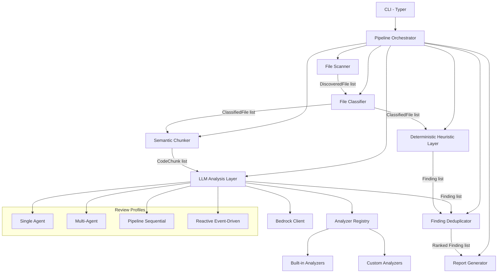

# Design Document: LLM Agent Battery

## Overview

The LLM Agent Battery is a unified CLI tool that combines the existing deterministic `agent_battery/` heuristic pipeline with an LLM-powered semantic analysis layer (Bedrock/Sonnet). The tool scans any codebase, classifies files by role, chunks code at semantic boundaries, runs fast structural heuristics, then invokes LLM reasoning for deeper analysis — producing deduplicated, ranked findings in structured JSON and Markdown reports.

The key design insight is that the deterministic layer provides fast, cheap, reproducible findings while the LLM layer catches logic bugs and design flaws that require reasoning. Both layers share data models and output format, and their findings merge into a single ranked list.

### Key Design Decisions

1. **Reuse existing scanner/classifier patterns** — The existing `agent_battery/` scanner and classifier are battle-tested. We extend them rather than rewriting.
2. **Layered architecture** — Deterministic heuristics always run first (fast, free). LLM layer runs second (deeper, costs money). Either can be skipped.
3. **Plugin-based analyzers** — Each analysis concern is an Analyzer instance with its own system prompt. New analyzers register via a simple base class.
4. **Async concurrency for LLM calls** — Use `asyncio` with semaphore-based concurrency control to parallelize Bedrock calls without throttling.
5. **Single unified Finding model** — Both layers produce the same `Finding` pydantic model, enabling trivial merging and deduplication.

## Architecture



### Pipeline Flow

1. **Scan** — Recursively discover files, apply include/exclude globs, skip files > 500KB
2. **Classify** — Assign semantic categories using content-based heuristics (AST, imports, decorators), with optional LLM fallback
3. **Chunk** — Split classified source files into reviewable units at function/class boundaries via AST
4. **Heuristic Analysis** — Run deterministic pattern checks (missing error handling, unguarded mutations, missing confirmation gates, prompt injection vectors)
5. **LLM Analysis** — Send chunks to Bedrock with Review_Profile-specific system prompts, parse structured findings from responses
6. **Deduplicate & Rank** — Merge findings from both layers, deduplicate by title+location, rank by severity then category
7. **Report** — Generate JSON + Markdown output

## Components and Interfaces

### 1. Scanner (`scanner.py`)

Extends the existing `agent_battery/agentbattery/scanner.py` pattern.

```python
def scan(target_dir: Path, config: ScanConfig) -> ScanResult:
    """Recursively discover files. Skip files > 500KB with warning."""
```

- Input: target directory path, `ScanConfig` (include/exclude globs)
- Output: `ScanResult` with list of `DiscoveredFile`, warnings for skipped files
- Supports Python, TypeScript, JavaScript, Go, Rust, YAML, JSON by default

### 2. Classifier (`classifier.py`)

Extends the existing priority-ordered heuristic approach, adding new categories and optional LLM fallback.

```python
def classify_files(files: list[DiscoveredFile], config: ClassifyConfig) -> list[ClassifiedFile]:
    """Classify files using content heuristics, optionally falling back to LLM."""
```

- Categories: `AGENT_LOGIC`, `TOOL_DEFINITION`, `ORCHESTRATION`, `STATE_MANAGEMENT`, `PROMPT_TEMPLATE`, `CONFIGURATION`, `TEST`, `INFRASTRUCTURE`, `UNKNOWN`
- Content-based heuristics first (AST patterns, import analysis, decorator detection)
- Path-based heuristics as fallback
- Optional LLM classification for `UNKNOWN` files when not in fast mode

### 3. Chunker (`chunker.py`)

New component. Uses AST parsing per language to split files into reviewable units.

```python
def chunk_file(classified_file: ClassifiedFile, config: ChunkConfig) -> list[CodeChunk]:
    """Split a source file into semantic chunks using AST parsing."""
```

- Python: split at function/class boundaries via `ast` module
- TypeScript/JavaScript: split at function/class/export boundaries
- Preserves module preamble (imports, constants) as prefix on each chunk
- Keeps classes with shared-state methods as single chunks
- Max chunk size configurable (default 12000 chars)
- Oversized functions become standalone chunks with truncation warning

### 4. Heuristic Analyzers (`heuristics/`)

Package of deterministic pattern checks that produce findings without LLM calls.

```python
class BaseHeuristicAnalyzer(ABC):
    @abstractmethod
    def analyze(self, files: list[ClassifiedFile]) -> list[Finding]: ...

class MissingErrorHandlingAnalyzer(BaseHeuristicAnalyzer): ...
class UnguardedMutationAnalyzer(BaseHeuristicAnalyzer): ...
class MissingConfirmationGateAnalyzer(BaseHeuristicAnalyzer): ...
class PromptInjectionAnalyzer(BaseHeuristicAnalyzer): ...
```

Each analyzer scans relevant classified files for specific anti-patterns using regex and AST inspection.

### 5. LLM Analyzer Layer (`analyzers/`)

Plugin-based LLM analysis with configurable review profiles.

```python
class BaseAnalyzer(ABC):
    """Base class handling Bedrock invocation, JSON parsing, retries."""
    
    @abstractmethod
    def system_prompt(self, profile: ReviewProfile) -> str: ...
    
    @abstractmethod
    def focus_areas(self) -> list[str]: ...
    
    async def analyze_chunk(self, chunk: CodeChunk, context: str) -> list[Finding]: ...

class AnalyzerRegistry:
    """Registry for built-in and custom analyzers."""
    
    def register(self, analyzer: BaseAnalyzer) -> None: ...
    def get_all(self) -> list[BaseAnalyzer]: ...
```

### 6. Bedrock Client (`bedrock_client.py`)

Wraps AWS Bedrock Runtime Converse API, following the pattern in `evalweaver/providers/bedrock_claude_provider.py`.

```python
class BedrockClient:
    """Handles LLM invocations with retry, timeout, and rate limiting."""
    
    async def converse(self, system: str, user: str, config: InferenceConfig) -> str: ...
    def validate_credentials(self) -> dict: ...
```

- Lazy client initialization
- Retry with exponential backoff (3 attempts for retryable errors)
- Connection timeout 30s, read timeout 300s
- Temperature 0.2 for consistency
- Token usage tracking

### 7. Review Profiles (`profiles/`)

YAML-defined analysis configurations.

```python
class ReviewProfile(BaseModel):
    name: str
    system_prompt_template: str
    focus_areas: list[str]
    anti_patterns: list[str]
```

Built-in profiles: `single-agent.yaml`, `multi-agent.yaml`, `pipeline-sequential.yaml`, `reactive.yaml`

Auto-detection logic examines classified files for patterns indicating architecture style.

### 8. Finding Deduplicator (`deduplicator.py`)

```python
def deduplicate_and_rank(findings: list[Finding]) -> list[Finding]:
    """Merge, deduplicate by title+location, rank by severity then category."""
```

- Same title + location → keep the more detailed one
- If found by both layers → annotate as "confirmed by heuristics"
- Severity ordering: CRITICAL > HIGH > MEDIUM > LOW
- Category ordering: logic_error > correctness > edge_case > design_flaw > other

### 9. Report Generator (`reporter.py`)

```python
def generate_reports(findings: list[Finding], config: ReportConfig) -> ReportOutput:
    """Produce JSON and Markdown reports from ranked findings."""
```

- JSON output with all findings sorted by severity
- Markdown report with severity badges grouped by file
- Summary section when findings > 200

### 10. Pipeline Orchestrator (`pipeline.py`)

```python
async def run_pipeline(config: PipelineConfig) -> PipelineResult:
    """Orchestrate the full scan → classify → chunk → analyze → report flow."""
```

Coordinates all components, manages concurrency, handles fast-mode skip of LLM layer.

### 11. CLI (`cli.py`)

Typer-based CLI with commands: `review`, `scan`.

```python
app = typer.Typer(name="llm-agent-battery")

@app.command()
def review(target: Path, profile: str, fast: bool, threshold: str, output_dir: Path, ci: bool): ...

@app.command()
def scan(target: Path, include: list[str], exclude: list[str]): ...
```

## Data Models

```python
from pydantic import BaseModel, Field
from enum import Enum
from pathlib import Path


# --- Enumerations ---

class FileCategory(str, Enum):
    AGENT_LOGIC = "AGENT_LOGIC"
    TOOL_DEFINITION = "TOOL_DEFINITION"
    ORCHESTRATION = "ORCHESTRATION"
    STATE_MANAGEMENT = "STATE_MANAGEMENT"
    PROMPT_TEMPLATE = "PROMPT_TEMPLATE"
    CONFIGURATION = "CONFIGURATION"
    TEST = "TEST"
    INFRASTRUCTURE = "INFRASTRUCTURE"
    UNKNOWN = "UNKNOWN"


class Severity(str, Enum):
    CRITICAL = "critical"
    HIGH = "high"
    MEDIUM = "medium"
    LOW = "low"


class FindingCategory(str, Enum):
    LOGIC_ERROR = "logic_error"
    CORRECTNESS = "correctness"
    EDGE_CASE = "edge_case"
    DATA_INTEGRITY = "data_integrity"
    DESIGN_FLAW = "design_flaw"
    SECURITY = "security"


class ArchitectureStyle(str, Enum):
    SINGLE_AGENT = "single-agent"
    MULTI_AGENT = "multi-agent-orchestrated"
    PIPELINE_SEQUENTIAL = "pipeline-sequential"
    REACTIVE_EVENT_DRIVEN = "reactive-event-driven"


# --- Core Models ---

class ScanConfig(BaseModel):
    include_globs: list[str] = Field(default_factory=lambda: [
        "*.py", "*.ts", "*.js", "*.go", "*.rs", "*.yaml", "*.yml", "*.json"
    ])
    exclude_globs: list[str] = Field(default_factory=lambda: [
        ".git", "__pycache__", "node_modules", ".venv", "venv",
        "dist", "build", "*.egg-info", ".agentbattery"
    ])
    max_file_size_bytes: int = 500 * 1024  # 500KB


class DiscoveredFile(BaseModel):
    path: Path
    relative_path: str
    size_bytes: int


class ScanWarning(BaseModel):
    file_path: str
    reason: str


class ScanResult(BaseModel):
    files: list[DiscoveredFile]
    warnings: list[ScanWarning] = Field(default_factory=list)
    total_count: int
    elapsed_seconds: float


class ClassifiedFile(BaseModel):
    path: Path
    relative_path: str
    size_bytes: int
    primary_category: FileCategory
    secondary_categories: list[FileCategory] = Field(default_factory=list)


class ClassifyConfig(BaseModel):
    use_llm_fallback: bool = True
    fast_mode: bool = False


class CodeChunk(BaseModel):
    file_path: str
    chunk_name: str
    content: str
    functions: list[str] = Field(default_factory=list)
    preamble: str = ""
    is_truncated: bool = False
    start_line: int = 0
    end_line: int = 0


class ChunkConfig(BaseModel):
    max_chunk_chars: int = 12000
    preserve_class_unity: bool = True


class Finding(BaseModel):
    severity: Severity
    category: FindingCategory
    file_path: str
    location: str  # function/class name
    title: str
    description: str
    impact: str
    remediation: str = ""
    source_layer: str = "llm"  # "heuristic" or "llm"
    confirmed_by_heuristic: bool = False


class ReviewProfile(BaseModel):
    name: str
    architecture_style: ArchitectureStyle
    system_prompt_template: str
    focus_areas: list[str]
    anti_patterns: list[str]


class InferenceConfig(BaseModel):
    model_id: str = "us.anthropic.claude-sonnet-4-6"
    max_tokens: int = 4096
    temperature: float = 0.2
    connect_timeout: int = 30
    read_timeout: int = 300


class ConcurrencyConfig(BaseModel):
    max_concurrent: int = 3
    min_delay_seconds: float = 1.0
    max_retries: int = 3
    backoff_base: float = 2.0


class PipelineConfig(BaseModel):
    target_dir: Path
    scan_config: ScanConfig = Field(default_factory=ScanConfig)
    classify_config: ClassifyConfig = Field(default_factory=ClassifyConfig)
    chunk_config: ChunkConfig = Field(default_factory=ChunkConfig)
    inference_config: InferenceConfig = Field(default_factory=InferenceConfig)
    concurrency_config: ConcurrencyConfig = Field(default_factory=ConcurrencyConfig)
    profile: ReviewProfile | None = None
    fast_mode: bool = False
    threshold: Severity = Severity.HIGH
    output_dir: Path | None = None
    ci_mode: bool = False


class TokenUsage(BaseModel):
    input_tokens: int = 0
    output_tokens: int = 0
    total_tokens: int = 0
    estimated_cost_usd: float = 0.0


class PipelineResult(BaseModel):
    findings: list[Finding]
    scan_result: ScanResult
    classified_files: list[ClassifiedFile]
    chunks_reviewed: int
    token_usage: TokenUsage
    elapsed_seconds: float
```


## Correctness Properties

*A property is a characteristic or behavior that should hold true across all valid executions of a system — essentially, a formal statement about what the system should do. Properties serve as the bridge between human-readable specifications and machine-verifiable correctness guarantees.*

### Property 1: Scanner respects include/exclude glob filters

*For any* directory tree and any pair of include/exclude glob configurations, every file returned by the scanner must match at least one include pattern and must not match any exclude pattern (nor reside under an excluded directory).

**Validates: Requirements 1.1**

### Property 2: Scanner skips oversized files with warning

*For any* directory containing files exceeding the configured max size (500KB default), none of those files shall appear in the scan results, and each shall produce a corresponding entry in the warnings list.

**Validates: Requirements 1.5**

### Property 3: Classifier assigns exactly one primary category

*For any* discovered file processed by the classifier, the resulting ClassifiedFile must have exactly one non-null primary_category and zero or more secondary_categories.

**Validates: Requirements 2.1**

### Property 4: Content-based heuristics take priority over path-based

*For any* file where content-based heuristics (AST patterns, import analysis, decorator detection) yield a category different from path-based heuristics, the primary_category must reflect the content-based result.

**Validates: Requirements 2.4**

### Property 5: Fast mode produces zero LLM invocations

*For any* pipeline run with fast_mode=True, the total token usage must be zero and no Bedrock API calls shall be made, regardless of input size or classification ambiguity.

**Validates: Requirements 2.5, 5.6, 8.4**

### Property 6: Chunk size invariant

*For any* source file and any max_chunk_chars configuration, all produced chunks must have `len(content) <= max_chunk_chars`, except for single functions that exceed the limit which become standalone chunks marked with `is_truncated=True`.

**Validates: Requirements 3.3, 3.6**

### Property 7: Chunker preserves module preamble

*For any* Python module with import statements and module-level constants, every chunk produced from that module must have a non-empty preamble field containing the module's imports and constants.

**Validates: Requirements 3.4**

### Property 8: Classes with shared state remain unified

*For any* Python class whose methods reference instance attributes (self.x) that are written in one method and read in another, the chunker must produce exactly one chunk containing the entire class rather than splitting it into per-method chunks.

**Validates: Requirements 3.5**

### Property 9: LLM response parsing extracts JSON from markdown

*For any* string containing valid JSON embedded within markdown code blocks (```json ... ``` or ``` ... ```), the parser must successfully extract and deserialize the JSON content identically to parsing the raw JSON directly.

**Validates: Requirements 4.7**

### Property 10: Retry behavior depends on error classification

*For any* sequence of Bedrock API errors, retryable errors (throttling, transient network) must trigger up to 3 retries with exponential backoff, while non-retryable errors (auth failure, validation) must produce a review-incomplete finding immediately with no retries.

**Validates: Requirements 4.4, 4.5**

### Property 11: Heuristic detectors identify unguarded patterns

*For any* code snippet containing a tool invocation without error handling, a state mutation without guard, a destructive operation without confirmation gate, or user input passed directly to a prompt template — the corresponding heuristic analyzer must produce at least one finding.

**Validates: Requirements 5.2, 5.3, 5.4, 5.5**

### Property 12: Architecture auto-detection selects matching profile

*For any* codebase with clear architecture signals (e.g., multiple agent classes with delegation = multi-agent; linear pipeline function calls = pipeline-sequential), the auto-detection must select the review profile matching that architecture style.

**Validates: Requirements 6.2**

### Property 13: Review profile YAML round-trip

*For any* valid ReviewProfile object, serializing it to YAML and loading it back must produce an equivalent ReviewProfile with identical system_prompt_template, focus_areas, and anti_patterns.

**Validates: Requirements 6.4**

### Property 14: Finding deduplication reduces duplicates

*For any* list of findings containing N entries where K entries share the same (title, file_path, location) tuple, deduplication must produce a list of exactly N - K + (number of unique duplicate groups) entries — i.e., each duplicate group collapses to one entry.

**Validates: Requirements 7.4, 11.1**

### Property 15: Cross-layer confirmation annotation

*For any* finding that exists in both the heuristic layer output and the LLM layer output (matching on title and file_path+location), the merged result must contain exactly one finding with `confirmed_by_heuristic=True` and the description from the LLM layer (the more detailed one).

**Validates: Requirements 11.3**

### Property 16: Finding ranking is total order

*For any* list of findings, the ranked output must be sorted such that: all CRITICAL findings precede HIGH, which precede MEDIUM, which precede LOW; and within the same severity, logic_error findings precede correctness, which precede edge_case, which precede design_flaw.

**Validates: Requirements 11.4, 7.2**

### Property 17: Concurrency control limits in-flight requests

*For any* set of chunks processed by the LLM layer, the number of simultaneously in-flight Bedrock API calls must never exceed the configured `max_concurrent` value.

**Validates: Requirements 10.1**

### Property 18: Minimum inter-request delay

*For any* pair of consecutive Bedrock API calls, the elapsed time between the start of the second call and the completion of the first call must be >= the configured `min_delay_seconds`.

**Validates: Requirements 10.2**

### Property 19: Token usage accounting

*For any* completed pipeline run, the reported `total_tokens` must equal the sum of `input_tokens + output_tokens` from all individual Bedrock API calls made during that run.

**Validates: Requirements 10.5**

### Property 20: Exit code reflects threshold

*For any* list of findings and any severity threshold, the exit code must be 1 if at least one finding has severity >= threshold, and 0 otherwise.

**Validates: Requirements 8.5, 8.8**

### Property 21: Custom analyzer findings merge into output

*For any* registered custom analyzer that produces findings, those findings must appear in the final deduplicated output alongside built-in analyzer findings, subject to the same deduplication and ranking rules.

**Validates: Requirements 12.2**

## Error Handling

### Bedrock API Errors

| Error Type | Behavior |
|---|---|
| Throttling (429) | Pause all in-flight, exponential backoff, retry up to 3x |
| Transient (500, 503, timeout) | Retry up to 3x with backoff |
| Auth failure (403) | Fail fast with credential setup instructions |
| Validation (400) | Record review-incomplete finding, continue |
| Model not found | Fail fast with model ID suggestion |

### File System Errors

- Target directory not found → exit code 2 with descriptive message
- Permission denied on individual files → skip file, record warning
- Disk full during report writing → raise with clear message

### JSON Parsing Errors

- Invalid JSON from LLM → attempt markdown extraction → record parse error finding if extraction fails
- Malformed findings (missing required fields) → skip individual finding, log warning

### Graceful Degradation

- If all LLM calls fail → produce heuristic-only report with warning banner
- If scanner finds zero files → exit 0 with "no files found" message
- If chunker fails on a file (AST parse error) → skip file, record warning

## Testing Strategy

### Unit Tests

Focus on specific examples, edge cases, and integration points:

- Scanner: empty directory, nested excluded dirs, files at size boundary
- Classifier: files matching multiple categories, ambiguous content
- Chunker: empty files, single-function files, class-only files, files with no functions
- Deduplicator: no duplicates, all duplicates, mixed duplicates across layers
- Report generator: zero findings, exactly 200 findings, 201 findings (summary trigger)
- CLI: invalid target path, missing credentials, unknown profile name

### Property-Based Tests

Use **Hypothesis** (Python property-based testing library) for all correctness properties.

Configuration:
- Minimum 100 iterations per property test (`@settings(max_examples=100)`)
- Each test tagged with: `# Feature: llm-agent-battery, Property {N}: {title}`

Property test implementation approach:
- **Scanner properties (1, 2)**: Generate random directory trees with `tmp_path` and random file sizes/extensions
- **Classifier properties (3, 4, 5)**: Generate random file content with known AST patterns
- **Chunker properties (6, 7, 8)**: Generate random valid Python source using AST node builders
- **Parser property (9)**: Generate random JSON payloads and wrap in random markdown formats
- **Retry property (10)**: Generate random error sequences and verify retry/no-retry behavior
- **Heuristic properties (11)**: Generate code snippets with/without guard patterns
- **Profile properties (12, 13)**: Generate random ReviewProfile objects and verify round-trip
- **Dedup/rank properties (14, 15, 16)**: Generate random Finding lists with controlled duplicates
- **Concurrency properties (17, 18, 19)**: Use mock Bedrock client with timing instrumentation
- **Exit code property (20)**: Generate random findings + threshold combinations
- **Custom analyzer property (21)**: Register mock analyzers that produce random findings

### Test Organization

```
tests/
├── unit/
│   ├── test_scanner.py
│   ├── test_classifier.py
│   ├── test_chunker.py
│   ├── test_heuristics.py
│   ├── test_deduplicator.py
│   ├── test_reporter.py
│   └── test_cli.py
├── property/
│   ├── test_scanner_props.py
│   ├── test_classifier_props.py
│   ├── test_chunker_props.py
│   ├── test_parser_props.py
│   ├── test_retry_props.py
│   ├── test_heuristic_props.py
│   ├── test_profile_props.py
│   ├── test_dedup_rank_props.py
│   ├── test_concurrency_props.py
│   ├── test_exit_code_props.py
│   └── test_analyzer_registry_props.py
└── integration/
    ├── test_pipeline_fast_mode.py
    └── test_pipeline_with_mock_bedrock.py
```
