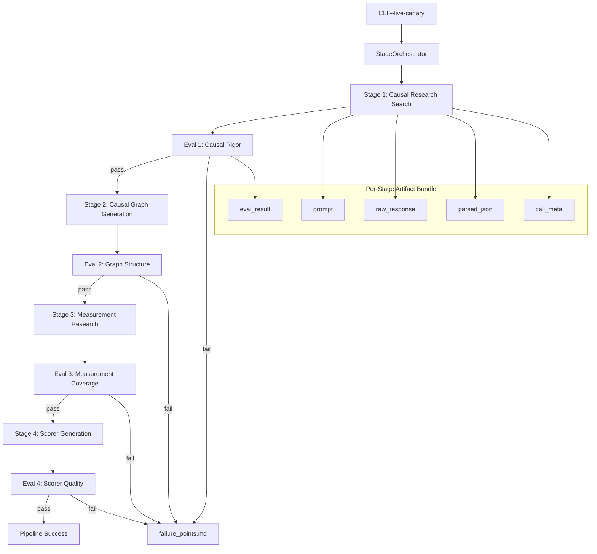

# Design Document: Stages 1–4 Reasoning Pipeline

## Overview

This design implements a live, four-stage reasoning pipeline that executes sequentially against AWS Bedrock (Claude Sonnet 4) to build a causal evidence base, convert it to a causal graph, map graph nodes to measurable text features, and generate diverse executable scorer functions. Each stage follows the pattern: prompt construction → LLM call → JSON parsing → deterministic evaluation → artifact persistence. The pipeline fails fast on eval failure, writing a failure_points.md report.

The implementation extends the existing EvalWeaver codebase, reusing `BedrockClaudeProvider` for LLM calls, `py_run_scorer` for sandboxed code execution, and the `artifacts` module for persistence. A new `evalweaver/stages.py` module encapsulates the four-stage pipeline, with `evalweaver/stage_eval.py` housing the deterministic eval engine.

## Architecture



The orchestrator (`StageOrchestrator`) owns the sequential flow. Each stage is a pure function: `(config, prev_output) → StageResult`. The eval engine is stateless: `(stage_output, pass_criteria, context) → EvalResult`.

## Components and Interfaces

### StageOrchestrator

```python
class StageOrchestrator:
    """Runs stages 1-4 sequentially, managing fail-fast and artifact persistence."""
    
    def __init__(self, provider: BedrockClaudeProvider, config: dict, out_dir: str):
        ...
    
    def run(self) -> dict:
        """Execute all stages. Returns summary dict with pass/fail per stage."""
        ...
```

### Stage Protocol

Each stage implements the same interface:

```python
@dataclass
class StageResult:
    stage_num: int
    stage_name: str
    prompt: dict            # {"system": str, "user": str}
    raw_response: str
    parsed_json: dict | None
    parse_error: str | None
    call_meta: dict         # latency_ms, retry_mode, max_attempts, error
    
def run_stage_1(config: dict) -> StageResult: ...
def run_stage_2(config: dict, stage1_output: dict) -> StageResult: ...
def run_stage_3(config: dict, stage2_output: dict) -> StageResult: ...
def run_stage_4(config: dict, stage2_output: dict, stage3_output: dict) -> StageResult: ...
```

### Eval Engine

```python
@dataclass
class EvalResult:
    signals: dict       # All computed eval signals
    passed: bool        # Whether all pass criteria met
    failures: list      # List of {"signal": str, "value": float, "threshold": float, "op": str}

def eval_stage_1(parsed_json: dict, pass_criteria: dict) -> EvalResult: ...
def eval_stage_2(parsed_json: dict, pass_criteria: dict) -> EvalResult: ...
def eval_stage_3(parsed_json: dict, pass_criteria: dict, stage2_nodes: list) -> EvalResult: ...
def eval_stage_4(parsed_json: dict, pass_criteria: dict, stage2_nodes: list, smoke_texts: list, anchor: str) -> EvalResult: ...
```

### Prompt Templates

Each stage has a prompt template function that takes structured inputs and returns `(system_prompt, user_message)`:

```python
def build_stage_1_prompt(target_variable: str) -> tuple[str, str]: ...
def build_stage_2_prompt(target_variable: str, stage1_research: list) -> tuple[str, str]: ...
def build_stage_3_prompt(target_variable: str, causal_nodes: list) -> tuple[str, str]: ...
def build_stage_4_prompt(target_variable: str, causal_graph: dict, measurement_research: list) -> tuple[str, str]: ...
```

### Artifact Persistence

Leverages existing `evalweaver.artifacts.save()`:

```python
def persist_stage_artifacts(stage_result: StageResult, eval_result: EvalResult, out_dir: str):
    """Save prompt, raw_response, parsed_json, eval_result, call_meta for one stage."""
    save(f"stage{stage_result.stage_num}_prompt", stage_result.prompt, out_dir)
    save(f"stage{stage_result.stage_num}_raw_response", {"text": stage_result.raw_response}, out_dir)
    save(f"stage{stage_result.stage_num}_parsed_json", stage_result.parsed_json, out_dir)
    save(f"stage{stage_result.stage_num}_eval_result", asdict(eval_result), out_dir)
    save(f"stage{stage_result.stage_num}_call_meta", stage_result.call_meta, out_dir)
```

### Failure Points Report

```python
def write_failure_points(out_dir: str, stage_results: list[tuple[StageResult, EvalResult]]) -> str:
    """Write failure_points.md summarizing pass/fail for each executed stage."""
    ...
```

## Data Models

### Stage 1 Output Schema

```python
Stage1Output = {
    "target_variable": str,
    "causal_research": [
        {
            "source_id": str,       # e.g. "SRC_001"
            "title": str,
            "url": str,
            "claim": str,
            "causal_variable": str,
            "effect_direction": str,  # "increases" | "decreases" | "mediates" | "moderates"
            "mechanism": str,
            "evidence_strength": str  # "high" | "medium" | "low"
        }
    ],
    "research_tensions": [
        {
            "claim": str,
            "variables": list[str]
        }
    ]
}
```

### Stage 2 Output Schema

```python
Stage2Output = {
    "target_variable": str,
    "causal_nodes": [
        {
            "node_id": str,
            "label": str,
            "role": str,          # "increases" | "decreases" | "mediates" | "moderates"
            "definition": str,
            "mechanism": str,
            "evidence": list[str]  # source_ids
        }
    ],
    "causal_edges": [
        {
            "from": str,           # node_id
            "to": str,             # node_id
            "relationship": str,
            "claim": str
        }
    ],
    "causal_tensions": [
        {
            "claim": str,
            "nodes": list[str]     # node_ids
        }
    ],
    "summary_theory": str
}
```

### Stage 3 Output Schema

```python
Stage3Output = {
    "target_variable": str,
    "measurement_research": [
        {
            "source_id": str,
            "causal_node": str,        # references Stage 2 node_id
            "title": str,
            "url": str,
            "measurement_claim": str,
            "text_features": list[str],
            "implementation_ideas": list[str]
        }
    ]
}
```

### Stage 4 Output Schema

```python
Stage4Output = {
    "target_variable": str,
    "scorers": [
        {
            "scorer_id": str,
            "hypothesis": str,
            "causal_nodes_used": list[str],
            "causal_edges_used": list[dict],  # [{"from": str, "to": str}]
            "causal_tensions_used": list[str],
            "measurement_ideas_used": list[str],
            "functional_form": str,
            "functional_form_rationale": str,
            "expected_failure_mode": str,
            "code": str  # Python function def scorer(text, anchor, params): ...
        }
    ]
}
```

### Pass Criteria (constants)

```python
STAGE_1_PASS_CRITERIA = {
    "num_research_items_min": 8,
    "num_unique_causal_variables_min": 5,
    "mechanism_completeness_rate_min": 0.75,
    "source_trace_rate_min": 0.9,
    "causal_specificity_score_min": 0.6,
    "tension_count_min": 1,
    "generic_advice_penalty_max": 0.25,
}

STAGE_2_PASS_CRITERIA = {
    "num_nodes_min": 5,
    "num_edges_min": 4,
    "node_mechanism_rate_min": 0.85,
    "node_evidence_rate_min": 0.8,
    "edge_validity_rate_min": 1.0,
    "edge_explanation_rate_min": 0.9,
    "graph_connectedness_score_min": 0.6,
    "role_diversity_score_min": 2,
    "tension_count_min": 1,
}

STAGE_3_PASS_CRITERIA = {
    "node_measurement_coverage_min": 0.7,
    "num_measurement_items_min": 8,
    "text_feature_specificity_score_min": 0.6,
    "implementation_actionability_score_min": 0.65,
    "generic_metric_penalty_max": 0.3,
    "multi_measurement_rate_min": 0.5,
    "node_reference_validity_rate_min": 1.0,
}

STAGE_4_PASS_CRITERIA = {
    "num_scorers_min": 5,
    "hypothesis_completeness_rate_min": 1.0,
    "causal_node_validity_rate_min": 1.0,
    "measurement_reference_rate_min": 0.8,
    "functional_form_diversity_min": 4,
    "interaction_usage_rate_min": 0.4,
    "normalization_usage_rate_min": 0.5,
    "code_exec_rate_min": 1.0,
    "numeric_return_rate_min": 1.0,
    "nonconstant_behavior_rate_min": 0.8,
    "scorer_distinctness_score_min": 0.75,
    "hypothesis_code_alignment_score_min": 0.5,
}

SMOKE_TEXTS = [
    "This works because it gives teams a concrete way to test ideas before committing.",
    "This is the best and most revolutionary solution ever made.",
    "The tool helps users compare options, see tradeoffs, and choose a next step.",
    "Maybe it helps in some cases, but the limits are unclear.",
]
```

### EvalResult

```python
@dataclass
class EvalResult:
    signals: dict          # e.g. {"num_research_items": 12, "mechanism_completeness_rate": 0.83, ...}
    passed: bool
    failures: list[dict]   # [{"signal": "tension_count", "value": 0, "threshold": 1, "op": ">="}]
```

### StageResult

```python
@dataclass
class StageResult:
    stage_num: int
    stage_name: str
    prompt: dict
    raw_response: str
    parsed_json: dict | None
    parse_error: str | None
    call_meta: dict
```


## Correctness Properties

*A property is a characteristic or behavior that should hold true across all valid executions of a system—essentially, a formal statement about what the system should do. Properties serve as the bridge between human-readable specifications and machine-verifiable correctness guarantees.*

### Property 1: Prompt construction includes all required inputs

*For any* target_variable and any valid prior-stage output, the constructed prompt for stages 1–4 SHALL contain the target_variable string, and for stages 2–4, SHALL contain data derived from the previous stage's parsed output.

**Validates: Requirements 1.1, 3.1, 5.1, 7.1**

### Property 2: Schema validation round-trip

*For any* valid Stage N output dict conforming to the documented schema, parsing/validation SHALL succeed. *For any* dict missing a required field (source_id, claim, causal_variable, effect_direction, mechanism for Stage 1 items; node_id, label, role, definition, mechanism, evidence for Stage 2 nodes; from, to, relationship, claim for Stage 2 edges; source_id, causal_node, measurement_claim, text_features, implementation_ideas for Stage 3 items; scorer_id, hypothesis, causal_nodes_used, functional_form, code for Stage 4 scorers), validation SHALL fail.

**Validates: Requirements 1.2, 1.3, 3.2, 3.3, 3.4, 5.2, 5.3, 7.2, 7.3, 7.4**

### Property 3: Artifact persistence round-trip

*For any* StageResult and EvalResult, persisting artifacts and then loading them back from disk SHALL produce equivalent JSON objects for all five artifact types (prompt, raw_response, parsed_json, eval_result, call_meta).

**Validates: Requirements 1.4, 3.5, 5.4, 7.5, 10.1**

### Property 4: Unparseable response halts pipeline

*For any* raw response string that is not valid JSON (random bytes, truncated JSON, plain text), the pipeline SHALL produce a parse_error, persist available artifacts, and not execute subsequent stages.

**Validates: Requirements 1.5, 3.6, 5.5, 7.6**

### Property 5: Mechanism completeness rate is correct fraction

*For any* list of causal_research items, mechanism_completeness_rate SHALL equal the count of items where all of (claim, causal_variable, effect_direction, mechanism, source_id) are non-empty strings, divided by total items.

**Validates: Requirements 2.2**

### Property 6: Causal specificity score rewards mechanistic language

*For any* set of claims, claims containing one or more mechanistic keywords (because, leads to, increases, decreases, mediates, moderates, causes, drives, reduces, through, by making, as a result) SHALL contribute positively to causal_specificity_score. The score SHALL be monotonically non-decreasing as more claims contain mechanistic keywords.

**Validates: Requirements 2.3**

### Property 7: Generic advice penalty only activates without mechanism

*For any* research item containing vague words (clear, good, engaging, effective, strong, better, important, high quality), the item SHALL contribute to generic_advice_penalty ONLY IF its mechanism field is empty. Items with a populated mechanism field SHALL not contribute to the penalty regardless of vague word presence.

**Validates: Requirements 2.4**

### Property 8: Pass criteria threshold check is correct

*For any* eval signals dict and pass criteria dict, the eval SHALL pass if and only if every signal meets its threshold (signal >= min_threshold for "_min" criteria, signal <= max_threshold for "_max" criteria). This applies uniformly across all four stages.

**Validates: Requirements 2.5, 4.5, 6.5, 8.6**

### Property 9: Edge validity rate counts only valid references

*For any* set of causal_nodes and causal_edges, edge_validity_rate SHALL equal the count of edges where both `from` and `to` match existing node_ids, divided by total edges.

**Validates: Requirements 4.2**

### Property 10: Graph connectedness counts participating nodes

*For any* set of causal_nodes and causal_edges, graph_connectedness_score SHALL equal the count of nodes appearing in at least one edge (as `from` or `to`), divided by total nodes.

**Validates: Requirements 4.3**

### Property 11: Node measurement coverage is correct fraction

*For any* set of Stage 2 causal_nodes and Stage 3 measurement_research items, node_measurement_coverage SHALL equal the count of distinct node_ids referenced by at least one measurement item, divided by total nodes.

**Validates: Requirements 6.2**

### Property 12: Node reference validity checks against Stage 2 nodes

*For any* set of measurement_research items and Stage 2 node_ids, node_reference_validity_rate SHALL equal the count of items whose causal_node field matches an existing node_id, divided by total items. This same logic applies to causal_node_validity_rate in Stage 4 (fraction of referenced causal_nodes_used existing in Stage 2).

**Validates: Requirements 6.3, 8.5**

### Property 13: Code execution rate counts exceptions correctly

*For any* list of scorer code strings and the four smoke texts, code_exec_rate SHALL equal the count of scorers that execute without raising an exception on ALL smoke texts, divided by total scorers. A scorer raising on any single smoke text SHALL be counted as failing.

**Validates: Requirements 8.2, 11.2, 11.3**

### Property 14: Nonconstant behavior requires output variance

*For any* scorer that produces the exact same numeric value across all four smoke texts, it SHALL fail the nonconstant_behavior check. *For any* scorer producing at least two different values across the smoke texts, it SHALL pass.

**Validates: Requirements 8.3, 12.3**

### Property 15: Scorer distinctness is unique tuple fraction

*For any* list of scorers, scorer_distinctness_score SHALL equal the count of unique tuples of (functional_form, frozenset(causal_nodes_used), frozenset(measurement_ideas_used)), divided by total scorers.

**Validates: Requirements 8.4**

### Property 16: Fail-fast halts subsequent stages

*For any* stage N (1 ≤ N ≤ 4) that fails evaluation, stages N+1 through 4 SHALL NOT execute. The pipeline result SHALL indicate failure at stage N.

**Validates: Requirements 9.1, 9.3, 2.6, 4.6, 6.6, 8.7**

### Property 17: Failure report contains all executed stage statuses

*For any* pipeline execution (whether successful or failed), the failure_points.md report SHALL contain an entry for every stage that was executed, including its pass/fail status and the specific signals that failed thresholds (if any).

**Validates: Requirements 10.2, 10.3**

## Error Handling

| Error Condition | Handling |
|---|---|
| Bedrock API timeout/network error | `BedrockClaudeProvider` retries up to 5 times (standard mode). If all fail, `call_meta.error` is set, artifacts persisted, pipeline halts. |
| Non-JSON response from LLM | `_parse_json_response` raises `json.JSONDecodeError`. Pipeline catches it, sets `parse_error` on StageResult, persists artifacts, writes failure_points.md, halts. |
| JSON response missing required fields | Schema validation returns list of missing fields. EvalResult marks as fail with signal values of 0. Pipeline halts. |
| Scorer code raises exception during smoke test | `py_run_scorer` catches all exceptions, returns `{"ok": False, "error": str(e)}`. Counted against `code_exec_rate`. |
| Scorer returns non-numeric | `py_run_scorer` attempts `float()` conversion. On failure, returns `{"ok": False}`. Counted against `numeric_return_rate`. |
| All stages fail immediately (Stage 1 fails) | Only Stage 1 artifacts are persisted. failure_points.md shows Stage 1 failed, stages 2–4 not attempted. |
| Provider credentials invalid | Caught at CLI level before pipeline starts (existing `_validate_bedrock`). Pipeline never enters stage execution. |

## Testing Strategy

### Property-Based Testing

Library: **Hypothesis** (Python) — already present in the project (`.hypothesis/` directory exists).

Each correctness property maps to a single Hypothesis test with `@given` decorators generating random stage outputs, eval signals, and scorer code. Tests run with `@settings(max_examples=100)`.

Tag format: `# Feature: stages-1-4-reasoning-pipeline, Property N: <title>`

Key generators needed:
- `st_stage1_output()`: generates random causal_research lists with variable field completeness
- `st_stage2_output()`: generates random causal graphs with variable edge validity
- `st_stage3_output()`: generates random measurement items with variable node references
- `st_stage4_output()`: generates random scorers with variable code quality
- `st_eval_signals()`: generates random signal dicts for threshold testing
- `st_scorer_code()`: generates simple valid/invalid Python scorer functions

### Unit Testing

Unit tests cover:
- Specific examples from the spec (the four smoke texts, the pass criteria values)
- Edge cases: empty lists, zero-length inputs, all-failing scorers
- Integration: `StageOrchestrator` with a mock provider that returns known JSON
- CLI integration: `--live-canary` flag correctly triggers the stage pipeline

### Test Organization

```
tests/
  test_stage_eval.py        # Property tests for eval signal computation (Properties 5-15)
  test_stage_schema.py      # Property tests for schema validation (Property 2)
  test_stage_pipeline.py    # Property tests for orchestration (Properties 1, 3, 4, 16, 17)
  test_stage_integration.py # Unit tests with mock provider end-to-end
```

### Configuration

- Property tests: `@settings(max_examples=100)`
- Each test tagged with: `# Feature: stages-1-4-reasoning-pipeline, Property N: <title>`
- Hypothesis profiles configured for CI (fewer examples) vs local (more examples)
