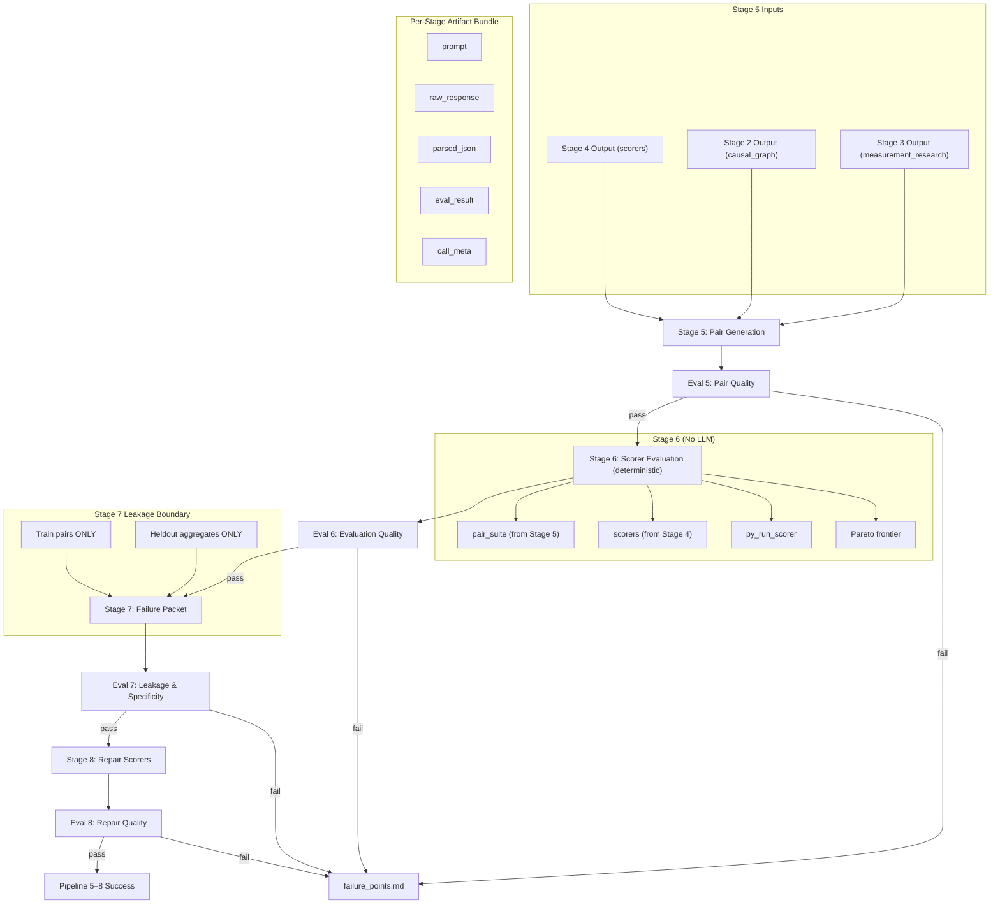

# Design Document: Stages 5–8 Reasoning Pipeline

## Overview

This design implements stages 5–8 of the EvalWeaver reasoning pipeline: evaluation pair generation (Stage 5), deterministic scorer evaluation with Pareto selection (Stage 6), failure packet generation (Stage 7), and repair scorer generation (Stage 8). These stages complete the evaluation-repair cycle that transforms the raw scorers from Stage 4 into a validated, Pareto-optimal scorer population.

Stages 5, 7, and 8 invoke LLM calls via the existing `BedrockClaudeProvider`. Stage 6 is purely deterministic—it uses `py_run_scorer` to evaluate scorers against the pair suite, computes per-scorer summaries, and identifies the Pareto frontier. The implementation extends the same modules established by Stages 1–4: `stage_models.py`, `stage_prompts.py`, `stage_eval.py`, and `stages.py`. Two new parallel generation modules (`stage5_parallel.py`, `stage8_parallel.py`) follow the exact pattern of `stage4_parallel.py`.

The hard gates vs soft targets philosophy carries forward: only structural failures (too few pairs, no executable scorers, heldout leakage) halt the pipeline. Quality signals are tracked for iterative prompt improvement but never block execution.

## Architecture



## Components and Interfaces

### Stage5to8Orchestrator

Extends the pipeline by accepting Stage 1–4 outputs as prerequisites:

```python
class Stage5to8Orchestrator:
    """Runs Stages 5–8 sequentially with fail-fast and artifact persistence."""

    def __init__(self, provider: BedrockClaudeProvider, config: dict, out_dir: str,
                 stage2_output: dict, stage3_output: dict, stage4_output: dict):
        ...

    def run(self) -> dict:
        """Execute all 4 stages (5–8). Returns summary dict."""
        ...
```

### Prompt Builders (stage_prompts.py extensions)

```python
def build_stage_5_prompt(target_variable: str, causal_graph: dict,
                         measurement_research: list, scorers: list,
                         source_policy: dict) -> tuple[str, str]: ...

def build_stage_7_prompt(target_variable: str, scorer_summaries: list,
                         train_eval_rows: list, pareto_frontier: list,
                         train_pairs: list, causal_graph: dict,
                         measurement_research: list,
                         heldout_aggregate: dict) -> tuple[str, str]: ...

def build_stage_8_prompt(target_variable: str, causal_graph: dict,
                         measurement_research: list, prior_scorers: list,
                         failure_packet: dict) -> tuple[str, str]: ...
```

Stage 6 has no prompt builder — it is purely deterministic.

### Eval Engine (stage_eval.py extensions)

```python
def eval_stage_5(parsed_json: dict, pass_criteria: dict,
                 stage2_nodes: list) -> EvalResult: ...

def eval_stage_6(scorer_summaries: list, pareto_frontier: list,
                 eval_rows: dict, pass_criteria: dict) -> EvalResult: ...

def eval_stage_7(parsed_json: dict, pass_criteria: dict,
                 heldout_pairs: list) -> EvalResult: ...

def eval_stage_8(parsed_json: dict, pass_criteria: dict,
                 stage2_nodes: list, stage7_patterns: list,
                 smoke_texts: list, anchor: str) -> EvalResult: ...
```

### Parallel Generation Modules

```python
# stage5_parallel.py
def build_single_pair_prompt(target_variable: str, causal_graph: dict,
                             measurement_research: list, pair_index: int,
                             causal_node_hint: str, source_policy: dict) -> tuple[str, str]: ...

def generate_pairs_parallel(provider_factory, target_variable: str,
                           causal_graph: dict, measurement_research: list,
                           n_pairs: int, max_workers: int,
                           source_policy: dict, out_dir: str) -> dict: ...

# stage8_parallel.py
def build_single_repair_scorer_prompt(target_variable: str, causal_graph: dict,
                                      measurement_research: list, scorer_index: int,
                                      failure_packet: dict, parent_scorer: dict,
                                      functional_form_hint: str) -> tuple[str, str]: ...

def generate_repair_scorers_parallel(provider_factory, target_variable: str,
                                     causal_graph: dict, measurement_research: list,
                                     prior_scorers: list, failure_packet: dict,
                                     n_scorers: int, max_workers: int,
                                     anchor: str, out_dir: str) -> dict: ...
```

### Stage 6 Deterministic Evaluation

```python
def run_stage_6(scorers: list, pair_suite: dict, anchor: str) -> dict:
    """
    Execute all scorers on all pairs deterministically.
    Returns {scorer_evaluations, scorer_summaries, pareto_frontier}.
    No LLM calls — uses py_run_scorer exclusively.
    """
    ...
```

## Data Models

### Stage 5 Output Schema (Pair Suite)

```python
Stage5Output = {
    "target_variable": str,
    "pairs": [
        {
            "pair_id": str,             # e.g. "P001"
            "source_id": str,           # reference to source material
            "source_trace": str,        # how this pair relates to source
            "anchor": str,              # shared context/anchor text
            "positive": str,            # text with MORE of target_variable
            "negative": str,            # text with LESS of target_variable
            "split": str,              # "train" or "heldout"
            "target_delta": str,        # description of what differs
            "controlled_variables": list[str],  # what's held constant
            "causal_nodes_tested": list[str],   # Stage 2 node_ids
            "causal_edges_tested": list[dict],  # [{"from": str, "to": str}]
            "measurement_ideas_tested": list[str],
            "causal_tensions_tested": list[str],
            "label_contract": str,      # reasoning for pos > neg
            "source_policy": str,       # policy compliance status
            "policy_violations": list[str]
        }
    ]
}
```

### Stage 6 Output Schema (Scorer Evaluation)

```python
Stage6Output = {
    "scorer_evaluations": {
        "<scorer_id>": [
            {
                "pair_id": str,
                "split": str,
                "positive_score": float,
                "negative_score": float,
                "gap": float,           # positive_score - negative_score
                "correct": bool         # gap > 0
            }
        ]
    },
    "scorer_summaries": [
        {
            "scorer_id": str,
            "train_accuracy": float,
            "train_mean_gap": float,
            "heldout_accuracy": float,
            "heldout_mean_gap": float,
            "score_spread": float,
            "exec_error_rate": float,
            "nonconstant_rate": float,
            "eligible": bool,
            "eligibility_reason": str
        }
    ],
    "pareto_frontier": [
        {
            "scorer_id": str,
            "heldout_accuracy": float,
            "heldout_mean_gap": float
        }
    ]
}
```

### Stage 7 Output Schema (Failure Packet)

```python
Stage7Output = {
    "failure_packet": {
        "top_scorers": [
            {
                "scorer_id": str,
                "hypothesis": str,
                "heldout_accuracy": float,
                "heldout_mean_gap": float
            }
        ],
        "failed_visible_pairs": [
            {
                "scorer_id": str,
                "pair_id": str,
                "positive_score": float,
                "negative_score": float,
                "gap": float
            }
        ],
        "low_margin_visible_pairs": [
            {
                "scorer_id": str,
                "pair_id": str,
                "gap": float
            }
        ]
    },
    "heldout_aggregate_only": {
        "heldout_accuracy_by_scorer": dict,   # {scorer_id: float}
        "heldout_mean_gap_by_scorer": dict    # {scorer_id: float}
    },
    "failure_patterns": [
        {
            "pattern_id": str,
            "scorer_ids": list[str],
            "visible_pair_ids": list[str],
            "causal_nodes_implicated": list[str],
            "reasoning_error": str,
            "severity": str              # "high" | "medium" | "low"
        }
    ],
    "mutation_instructions": [
        {
            "instruction_id": str,
            "targets_failure_patterns": list[str],
            "instruction": str,
            "expected_metric_movement": str
        }
    ],
    "pair_suite_coverage_notes": str
}
```

### Stage 8 Output Schema (Repair Scorers)

```python
Stage8Output = {
    "target_variable": str,
    "repair_scorers": [
        {
            "scorer_id": str,            # e.g. "RS0"
            "lineage": str,              # "repair_round_1"
            "parent_scorer_ids": list[str],
            "targets_failure_patterns": list[str],  # pattern_ids from Stage 7
            "hypothesis": str,
            "causal_nodes_used": list[str],
            "measurement_ideas_used": list[str],
            "functional_form": str,
            "repair_strategy": str,       # describes the repair approach
            "expected_failure_mode": str,
            "code_feature_map": dict,     # {feature_name: implementation_note}
            "code": str                   # def scorer(text, anchor, params): ...
        }
    ]
}
```

### Hard Gates and Soft Targets

```python
# Stage 5
STAGE_5_HARD_GATES = {
    "num_pairs_min": 6,
    "pair_schema_completeness_rate_min": 0.5,
}
STAGE_5_SOFT_TARGETS = {
    "source_trace_rate_target": 0.8,
    "causal_node_reference_validity_rate_target": 0.8,
    "controlled_variable_pass_rate_target": 0.7,
    "length_balance_rate_target": 0.7,
    "minimal_contrast_rate_target": 0.6,
    "target_direction_clarity_rate_target": 0.8,
    "positive_policy_pass_rate_target": 0.9,
}

# Stage 6
STAGE_6_HARD_GATES = {
    "num_scorers_evaluated_min": 3,
    "execution_valid_rate_min": 0.3,
}
STAGE_6_SOFT_TARGETS = {
    "eligible_scorer_count_target": 3,
    "pareto_count_target": 2,
    "nonconstant_scorer_rate_target": 0.5,
    "heldout_accuracy_presence_rate_target": 0.8,
}

# Stage 7
STAGE_7_HARD_GATES = {
    "failure_pattern_count_min": 1,
    "heldout_raw_text_leakage_count_max": 0,
}
STAGE_7_SOFT_TARGETS = {
    "top_scorer_coverage_rate_target": 0.8,
    "visible_failure_reference_rate_target": 0.5,
    "failure_pattern_specificity_score_target": 0.6,
    "mutation_actionability_score_target": 0.7,
    "causal_reference_rate_target": 0.5,
}

# Stage 8
STAGE_8_HARD_GATES = {
    "num_repair_scorers_min": 2,
    "code_exec_rate_min": 0.3,
}
STAGE_8_SOFT_TARGETS = {
    "failure_pattern_target_rate_target": 0.8,
    "lineage_completeness_rate_target": 0.9,
    "causal_node_validity_rate_target": 0.8,
    "measurement_reference_rate_target": 0.7,
    "nonconstant_behavior_rate_target": 0.6,
    "functional_form_diversity_target": 3,
    "parent_distinctness_rate_target": 0.5,
}
```


## Correctness Properties

*A property is a characteristic or behavior that should hold true across all valid executions of a system—essentially, a formal statement about what the system should do. Properties serve as the bridge between human-readable specifications and machine-verifiable correctness guarantees.*

### Property 1: Prompt construction includes required inputs

*For any* target_variable and any valid prior-stage outputs (causal_graph, measurement_research, scorers, failure_packet), the constructed prompt for Stages 5, 7, and 8 SHALL contain the target_variable string and SHALL contain data derived from the required prior-stage outputs specific to that stage.

**Validates: Requirements 1.1, 5.1, 7.1**

### Property 2: Schema validation round-trip

*For any* valid Stage 5 output dict conforming to the pair suite schema (with all required pair fields: pair_id, anchor, positive, negative, split, target_delta, controlled_variables), validation SHALL succeed. *For any* dict missing a required field, validation SHALL fail. The same applies to Stage 7 (failure_patterns, mutation_instructions) and Stage 8 (repair_scorers with scorer_id, hypothesis, causal_nodes_used, functional_form, code containing `def scorer(text, anchor, params)`).

**Validates: Requirements 1.2, 5.2, 7.2, 7.3**

### Property 3: Artifact persistence round-trip

*For any* StageResult and EvalResult from Stages 5–8, persisting artifacts and then loading them back from disk SHALL produce equivalent JSON objects for all artifact types (prompt, raw_response, parsed_json, eval_result, call_meta).

**Validates: Requirements 1.4, 3.5, 5.4, 7.4, 10.1, 10.2**

### Property 4: Unparseable response halts pipeline

*For any* raw response string that is not valid JSON (random bytes, truncated JSON, plain text) received by Stages 5, 7, or 8, the pipeline SHALL produce a parse_error, persist available artifacts, and not execute subsequent stages.

**Validates: Requirements 1.5, 5.5, 7.5**

### Property 5: Hard gate threshold check is correct

*For any* eval signals dict and hard gate criteria dict (for any of Stages 5–8), the eval SHALL pass if and only if every signal meets its threshold (signal >= min_threshold for "_min" criteria, signal <= max_threshold for "_max" criteria).

**Validates: Requirements 2.5, 4.5, 6.4, 8.6**

### Property 6: Fail-fast halts subsequent stages

*For any* stage N (5 ≤ N ≤ 8) that fails hard gate evaluation, stages N+1 through 8 SHALL NOT execute. The pipeline result SHALL indicate failure at stage N and the number of stages passed.

**Validates: Requirements 2.7, 4.7, 6.6, 8.8, 9.1, 9.3**

### Property 7: pair_schema_completeness_rate is correct fraction

*For any* list of pairs where each pair has a random subset of required fields (pair_id, anchor, positive, negative, split, target_delta, controlled_variables) populated, pair_schema_completeness_rate SHALL equal the count of pairs with ALL required fields populated divided by total pairs.

**Validates: Requirements 2.2**

### Property 8: causal_node_reference_validity_rate checks against Stage 2 nodes

*For any* list of pairs with causal_nodes_tested fields and any set of Stage 2 node_ids, causal_node_reference_validity_rate SHALL equal the count of pairs where ALL entries in causal_nodes_tested exist in the Stage 2 node_ids set, divided by total pairs.

**Validates: Requirements 2.3**

### Property 9: length_balance_rate computation is correct

*For any* list of pairs with positive and negative text fields and a max_words_per_variant configuration value, length_balance_rate SHALL equal the fraction of pairs where `abs(len(positive.split()) - len(negative.split())) <= max_words_per_variant * 0.3`.

**Validates: Requirements 2.4**

### Property 10: Stage 6 accuracy is correct_count / total_pairs per split

*For any* set of scorer evaluation rows split into train and heldout, train_accuracy SHALL equal the count of correct rows in train split divided by total train rows, and heldout_accuracy SHALL equal the count of correct rows in heldout split divided by total heldout rows. Mean gap SHALL equal the arithmetic mean of gap values per split.

**Validates: Requirements 3.2, 3.3**

### Property 11: Pareto frontier is non-dominated set

*For any* set of eligible scorer summaries with heldout_accuracy and heldout_mean_gap dimensions, every scorer in the Pareto frontier SHALL NOT be dominated by any other eligible scorer (no other scorer has both dimensions ≥ and at least one strictly >). Every scorer NOT in the frontier SHALL be dominated by at least one frontier member.

**Validates: Requirements 4.1**

### Property 12: Pareto eligibility is conjunction of five conditions

*For any* scorer summary, the scorer SHALL be eligible if and only if: exec_error_rate == 0, nonconstant_rate > 0 (or nonconstant output), score_spread >= 0.02, heldout_accuracy >= 0.50, and heldout_mean_gap > 0. If any condition fails, the scorer SHALL be ineligible.

**Validates: Requirements 4.2**

### Property 13: overfit_warning_count detects train > heldout + 0.2

*For any* set of scorer summaries with train_accuracy and heldout_accuracy, overfit_warning_count SHALL equal the count of scorers where train_accuracy > heldout_accuracy + 0.2.

**Validates: Requirements 4.4**

### Property 14: Heldout leakage detection catches matching text

*For any* Stage 7 output string and any set of heldout pairs, heldout_raw_text_leakage_count SHALL be > 0 if and only if any raw heldout pair positive or negative text appears as a substring in the Stage 7 output. If no heldout text appears, leakage_count SHALL be 0.

**Validates: Requirements 5.3, 6.2, 12.1, 12.2, 12.3, 12.4**

### Property 15: mutation_actionability_score checks for action verbs

*For any* list of mutation_instructions, mutation_actionability_score SHALL equal the fraction of instructions whose text contains at least one action verb from the set (add, remove, replace, combine, split, increase, decrease, weight, gate, normalize, multiply).

**Validates: Requirements 6.3**

### Property 16: code_exec_rate counts exceptions correctly

*For any* list of repair scorer code strings and the four smoke texts, code_exec_rate SHALL equal the count of scorers that execute without raising an exception on ALL smoke texts, divided by total scorers. A scorer raising on any single smoke text SHALL be counted as failing.

**Validates: Requirements 8.2, 11.2**

### Property 17: nonconstant_behavior_rate requires output variance

*For any* scorer that produces the exact same numeric value across all four smoke texts, it SHALL fail the nonconstant_behavior check. *For any* scorer producing at least two different values across the smoke texts, it SHALL pass.

**Validates: Requirements 8.3, 11.3**

### Property 18: failure_pattern_target_rate is correct fraction

*For any* list of repair scorers and any set of valid pattern_ids from Stage 7, failure_pattern_target_rate SHALL equal the count of repair scorers whose targets_failure_patterns field contains at least one valid pattern_id, divided by total repair scorers.

**Validates: Requirements 8.4**

### Property 19: unsafe_code_penalty detects forbidden patterns

*For any* scorer code string, unsafe_code_penalty SHALL be non-zero if and only if the code contains at least one of: an import statement, `open(`, `exec(`, `eval(`, or network-related function references (`requests`, `urllib`, `socket`). Code without any forbidden patterns SHALL have a penalty of 0.

**Validates: Requirements 8.5**

### Property 20: Parallel generation aggregates into valid schema

*For any* set of individual parallel generation results (mix of successes and failures), the aggregated output SHALL conform to the same output schema as sequential generation. Failed individual calls SHALL be excluded from the result set but SHALL NOT prevent successful results from being included.

**Validates: Requirements 1.6, 7.6, 13.1, 13.2, 13.3, 13.4**

### Property 21: Split assignment respects heldout_count

*For any* list of N pairs and a heldout_count value H (where H < N), after split assignment exactly H pairs SHALL have split="heldout" and N-H pairs SHALL have split="train".

**Validates: Requirements 1.3**

### Property 22: Soft targets tracked but never block pipeline

*For any* eval signals dict that passes all hard gates but fails one or more soft targets, the EvalResult.passed SHALL be True. Soft target misses SHALL appear in EvalResult.soft_evals but SHALL NOT appear in EvalResult.failures.

**Validates: Requirements 2.6, 4.6, 6.5, 8.7**

### Property 23: Failure report contains all executed stage statuses

*For any* pipeline execution of Stages 5–8 (whether successful or failed), the failure_points.md report SHALL contain an entry for every stage that was executed, including its pass/fail status and the specific hard gate signals that failed (if any).

**Validates: Requirements 10.3**

## Error Handling

| Error Condition | Handling |
|---|---|
| Bedrock API timeout/network error (Stages 5, 7, 8) | `BedrockClaudeProvider` retries up to 5 times. If all fail, `call_meta.error` set, artifacts persisted, pipeline halts. |
| Non-JSON response from LLM (Stages 5, 7, 8) | `_parse_json_response` raises `JSONDecodeError`. Truncated JSON repair attempted via `_repair_truncated_json`. If repair fails, `parse_error` set on StageResult, artifacts persisted, pipeline halts. |
| JSON response missing required fields | Schema validation returns errors. EvalResult marks as fail with signal values of 0. Pipeline halts at hard gate check. |
| Scorer code raises exception during Stage 6 eval | `py_run_scorer` catches all exceptions, returns `{"ok": False}`. Counted against `exec_error_rate` and `execution_valid_rate`. |
| Scorer returns non-numeric during Stage 6 eval | `py_run_scorer` attempts `float()`. On failure, returns `{"ok": False}`. Counted against `numeric_return_rate`. |
| Heldout leakage detected in Stage 7 output | `heldout_raw_text_leakage_count > 0` triggers hard gate failure. Pipeline halts with explicit leakage warning in failure_points.md. |
| Repair scorer code contains unsafe patterns (import, open, exec, eval, network) | `unsafe_code_penalty` computed > 0. Tracked as soft signal. Code still executed via `py_run_scorer` (namespace isolation prevents actual harm). |
| Parallel generation: individual call fails | Failed call logged but does not abort remaining parallel calls. Partial results aggregated. If too few succeed, hard gate on count fails pipeline. |
| Stage 6 produces zero eligible scorers | `eligible_scorer_count = 0`, Pareto frontier is empty. Soft target miss. If `num_scorers_evaluated < 3`, hard gate fails. |
| All stages fail immediately (Stage 5 fails) | Only Stage 5 artifacts persisted. failure_points.md shows Stage 5 failed, Stages 6–8 not attempted. |
| Provider credentials invalid | Caught at CLI level before pipeline starts (existing `_validate_bedrock`). Pipeline never enters stage execution. |

## Testing Strategy

### Property-Based Testing

Library: **Hypothesis** (Python) — already present in the project (`.hypothesis/` directory exists).

Each correctness property maps to a single Hypothesis test with `@given` decorators generating random stage outputs, eval signals, and scorer code. Tests run with `@settings(max_examples=100)`.

Tag format: `# Feature: stages-5-8-reasoning-pipeline, Property N: <title>`

Key generators needed:
- `st_stage5_output()`: generates random pair suites with variable field completeness and causal_node references
- `st_stage6_eval_rows()`: generates random per-scorer eval rows with train/heldout splits
- `st_scorer_summaries()`: generates random scorer summaries with variable accuracy/gap/spread
- `st_stage7_output()`: generates random failure packets with variable pattern counts and leakage
- `st_stage8_output()`: generates random repair scorers with variable code quality and pattern references
- `st_heldout_pairs()`: generates random heldout pair text for leakage detection testing
- `st_scorer_code()`: generates simple valid/invalid Python scorer functions (reuse from stages 1-4)
- `st_eval_signals()`: generates random signal dicts for threshold testing (reuse from stages 1-4)

### Unit Testing

Unit tests cover:
- Specific examples: Stage 6 evaluation with known scorers and pairs producing expected accuracy/gap values
- Edge cases: empty pair suites, zero scorers, all scorers constant, all scorers failing execution
- Integration: `Stage5to8Orchestrator` with a mock provider returning known JSON for each stage
- Heldout leakage: explicit test where heldout text is injected into Stage 7 output, verify detection
- Pareto: known non-dominated sets verified against expected frontier
- CLI integration: verify stages 5–8 trigger correctly after stages 1–4 pass

### Integration Tests with Mock Provider

```python
class TestStage5to8Integration:
    """End-to-end tests using MockProvider with scripted responses."""

    def test_all_stages_pass(self): ...
    def test_stage5_fails_halts(self): ...
    def test_stage6_fails_no_eligible_scorers(self): ...
    def test_stage7_leakage_detected_halts(self): ...
    def test_stage8_fails_no_executable_scorers(self): ...
    def test_parallel_stage5_partial_failures(self): ...
    def test_parallel_stage8_partial_failures(self): ...
```

### Test Organization

```
tests/
  test_stage5_8_eval.py       # Property tests for eval signal computation (Properties 7-19)
  test_stage5_8_schema.py     # Property tests for schema validation (Property 2)
  test_stage5_8_pipeline.py   # Property tests for orchestration (Properties 1, 3-6, 20-23)
  test_stage5_8_integration.py # Unit tests with mock provider end-to-end
```

### Configuration

- Property tests: `@settings(max_examples=100)`
- Each test tagged with: `# Feature: stages-5-8-reasoning-pipeline, Property N: <title>`
- Hypothesis profiles configured for CI (fewer examples) vs local (more examples)
- Reuse existing Hypothesis strategies from `tests/test_stage_eval.py` where applicable (scorer code generators, eval signal generators)
