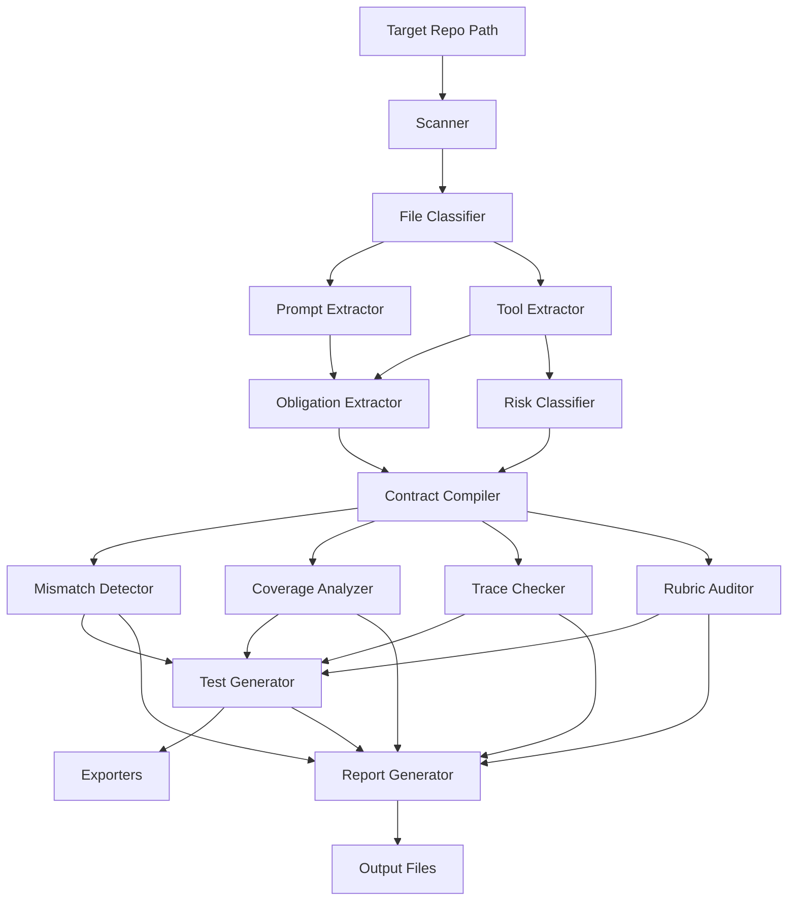

# Design Document: agent-battery

## Overview

`agentbattery` is a deterministic, LLM-free Python CLI that audits AI agent repositories for safety and compliance gaps. It discovers agent artifacts (prompts, tools, schemas, traces), extracts obligations, classifies risk, compiles a unified contract, detects architectural mismatches, checks traces, generates missing tests, and produces reports.

The core value proposition is **prompt-only safety detection**: identifying cases where a prompt promises a safety property (e.g., "always confirm before sending") but no runtime enforcement (tool precondition, schema constraint, or test) backs it up.

The pipeline produces four gap types:
- **POLICY_GAP**: A dangerous tool has no associated obligation at all.
- **ENFORCEMENT_GAP**: An obligation exists but no runtime mechanism enforces it.
- **COVERAGE_GAP**: An obligation exists but no test/eval covers it.
- **TRACE_VIOLATION**: An actual execution trace violates the obligation.

## Architecture

### High-Level Data Flow



### Pipeline Stages

The audit pipeline executes sequentially in eight stages:

1. **Discovery** — Scanner walks repo, File Classifier assigns categories.
2. **Extraction** — Prompt Extractor and Tool Extractor produce artifacts.
3. **Analysis** — Obligation Extractor finds obligations; Risk Classifier scores tools.
4. **Compilation** — Contract Compiler links artifacts into AgentContract.
5. **Detection** — Mismatch Detector and Coverage Analyzer find gaps; Trace Checker validates traces.
6. **Architecture Audit** — Rubric Auditor assesses six architecture dimensions and populates policy models.
7. **Generation** — Test Generator creates missing test cases from findings.
8. **Reporting** — Report Generator and Exporters produce outputs.

Each stage receives its inputs from the previous stage's outputs. All stages are pure functions of their inputs (no global state, no randomness).

### Design Decisions

| Decision | Rationale |
|----------|-----------|
| No LLM dependency | Determinism, CI-friendliness, offline operation |
| Regex/keyword pattern matching | Reproducible extraction without model variance |
| Priority-based classification | Single deterministic category per file, no ambiguity |
| Pydantic v2 models | Runtime validation, serialization, clear error messages |
| YAML as primary interchange | Human-editable, diffable, version-controllable |
| Jinja2 templates | Flexible output formatting without code duplication |
| Typer + Rich CLI | Modern CLI UX with progress display |

## Components and Interfaces

### scanner.py

```python
def scan(target_dir: Path, include_globs: list[str] | None = None, exclude_globs: list[str] | None = None) -> ScanResult:
    """Recursively walk target_dir, apply glob filters, return DiscoveredFile list."""
```

- Default includes: `*.py, *.md, *.yaml, *.yml, *.json, *.jsonl, *.toml`
- Default excludes: `.git, __pycache__, node_modules, .venv, .env, dist, build, *.egg-info`
- Returns `ScanResult` containing `files: list[DiscoveredFile]`, `total_count: int`, `elapsed_seconds: float`

### file_classifier.py

```python
def classify(file: DiscoveredFile) -> ClassifiedFile:
    """Assign primary FileCategory using priority-ordered heuristics."""
```

Priority order (highest first): TRACE > TOOL_SCHEMA > TOOL_SOURCE > PROMPT > POLICY > EVAL > CONFIG > DOC > UNKNOWN

Each heuristic is a function `(path: Path, content: str | None) -> bool`. The classifier runs heuristics in priority order and stops at the first match. Secondary matches are recorded in `ClassifiedFile.secondary_categories`.

Heuristic rules:
- **TRACE**: `.jsonl` extension, or JSON with `steps`/`tool_calls`/`messages[].role` keys.
- **TOOL_SCHEMA**: JSON/YAML containing `functions[].parameters` or `tools[].input_schema` structure.
- **TOOL_SOURCE**: Python file with `@tool`, `@function_tool`, or `@agent.tool` decorator.
- **PROMPT**: Path contains "prompt"/"system"/"instructions", or content has imperative phrases ("You must", "You are", "Always").
- **POLICY**: Path contains "policy"/"rules"/"guardrail".
- **EVAL**: Path contains "eval"/"test"/"spec".
- **CONFIG**: `.toml`, `.cfg`, or path contains "config"/"settings".
- **DOC**: `.md` not matching PROMPT/POLICY, or `.txt`, `.rst`.
- **UNKNOWN**: Fallback.

### prompt_extractor.py

```python
def extract_prompts(files: list[ClassifiedFile]) -> list[PromptArtifact]:
    """Extract structured prompt content from PROMPT-classified files."""
```

Extraction strategies by file type:
- **Markdown**: Full text content.
- **YAML**: Values from keys `system_prompt`, `prompt`, `instructions`, `content`.
- **Python**: String literals assigned to `SYSTEM_PROMPT`, `*_PROMPT`, `*_INSTRUCTIONS` variables; triple-quoted docstrings in functions named `*prompt*` or `*system*`.

### tool_extractor.py

```python
def extract_tools(files: list[ClassifiedFile]) -> list[ToolArtifact]:
    """Extract tool definitions from TOOL_SOURCE and TOOL_SCHEMA files."""
```

- **Python AST parsing**: Find functions with `@tool`, `@function_tool`, `@agent.tool` decorators. Extract name, docstring (description), parameter annotations, return annotation.
- **JSON/YAML schema parsing**: Detect OpenAI-style (`functions[].name`, `functions[].parameters`) or Anthropic-style (`tools[].name`, `tools[].input_schema`) structures. Extract name, description, parameters with types and required status.
- Infers preconditions from parameter constraints (e.g., `enum` values, `minLength`) and docstring content (e.g., "Requires confirmation").

### obligation_extractor.py

```python
def extract_obligations(prompts: list[PromptArtifact], tools: list[ToolArtifact]) -> list[Obligation]:
    """Apply pattern registry to extract obligations from prompt text and tool metadata."""
```

Pattern registry (deterministic regex patterns):

| ObligationType | Example Patterns |
|----------------|-----------------|
| CONFIRMATION_REQUIRED | `confirm before`, `ask.*user.*before`, `require.*approval`, `never.*without.*confirm` |
| LOOKUP_REQUIRED | `look up`, `retrieve.*before`, `check.*first`, `fetch.*before` |
| POLICY_CHECK_REQUIRED | `check.*policy`, `verify.*eligibility`, `compliance.*check` |
| ERROR_REPORTING_REQUIRED | `report.*error`, `inform.*user.*fail`, `disclose.*error` |
| RETRIEVAL_INJECTION_GUARD | `sanitize`, `validate.*input`, `guard.*injection`, `do not trust` |
| FINAL_STATE_CONSISTENCY | `verify.*state`, `confirm.*result`, `ensure.*consistency` |

Each obligation gets a stable ID: `sha256(source_path + ":" + pattern_type + ":" + match_start_offset)[:12]`

### risk_classifier.py

```python
def classify_risk(tool: ToolArtifact) -> SideEffectLevel:
    """Assign side-effect level based on keyword matching against name and description."""
```

Keyword sets (checked against lowercased tool name + description):
- **DESTRUCTIVE**: `delete, remove, drop, terminate, revoke, destroy, purge, wipe`
- **EXTERNAL_WRITE**: `send, post, update, write, create, transfer, publish, submit, execute, deploy`
- **WEAK**: `log, notify, cache, tag, mark, annotate`
- **NONE**: Default when no side-effect keywords match.

Priority: DESTRUCTIVE > EXTERNAL_WRITE > WEAK > NONE (highest matching level wins).

### contract_compiler.py

```python
def compile_contract(
    prompts: list[PromptArtifact],
    tools: list[ToolArtifact],
    obligations: list[Obligation],
    risk_levels: dict[str, SideEffectLevel],
) -> AgentContract:
    """Link obligations to tools and assemble the contract."""
```

Linking algorithm:
1. For each obligation, tokenize the obligation source text.
2. For each tool, tokenize name + description.
3. Compute token overlap score. Link obligation to tool if score exceeds threshold (≥1 shared meaningful token after stopword removal).
4. Build ForbiddenTransition entries from obligations containing ordering language ("before", "after", "must precede").

Output: `AgentContract` with linked obligations, tools, prompts, forbidden transitions, and risk map.

### mismatch_detector.py

```python
def detect_mismatches(contract: AgentContract, classified_files: list[ClassifiedFile]) -> list[Finding]:
    """Run checks A-G against the contract and produce findings."""
```

Checks:
- **A (POLICY_GAP)**: Dangerous tool (DESTRUCTIVE/EXTERNAL_WRITE) with zero linked obligations.
- **B (ENFORCEMENT_GAP)**: CONFIRMATION_REQUIRED obligation linked to tool but no precondition in tool source.
- **C (ENFORCEMENT_GAP)**: Financial tool missing POLICY_CHECK_REQUIRED precondition.
- **D (POLICY_GAP)**: DESTRUCTIVE tool with no CONFIRMATION_REQUIRED obligation.
- **E (POLICY_GAP)**: Retrieval tools + external write tools present but no RETRIEVAL_INJECTION_GUARD.
- **F (ENFORCEMENT_GAP)**: FINAL_STATE_CONSISTENCY obligation with no verification step linked.
- **G (ENFORCEMENT_GAP)**: High-risk tool with all-optional schema parameters (permissive schema).

Additionally detects prompt-only safety: prompt asserts safety property → obligation extracted → no runtime enforcement detected → ENFORCEMENT_GAP.

All findings use uncertainty wording for absence-based evidence.

### coverage_analyzer.py

```python
def analyze_coverage(contract: AgentContract, eval_files: list[ClassifiedFile]) -> CoverageResult:
    """Keyword-match obligations against test/eval file content."""
```

Matching logic:
- Extract tokens from obligation text.
- For each eval file, check if tokens appear in content.
- Score: `matched_tokens / total_tokens`. Thresholds: `>=0.6 → covered`, `>=0.3 → partial`, `<0.3 → missing`.
- Emit COVERAGE_GAP findings for `missing` obligations at CRITICAL/HIGH severity.

### trace_loader.py

```python
def load_traces(files: list[ClassifiedFile]) -> list[AgentTrace]:
    """Parse JSONL and JSON trace files into AgentTrace objects."""
```

Normalization rules:
- Each entry maps to a `TraceStep` with `type`, `tool_name`, `arguments`, `result`.
- Type inference: presence of `tool_call`/`function_call` → TOOL_CALL; `tool_result`/`function_result` → TOOL_RESULT; `role: "assistant"` → AGENT_MESSAGE; `role: "user"` → USER_MESSAGE.
- Malformed entries are skipped with logged warnings.

### trace_checker.py

```python
def check_traces(traces: list[AgentTrace], contract: AgentContract) -> list[Finding]:
    """Run six trace checks against the contract."""
```

Checks:
1. **Forbidden tool use**: Tool call violates a ForbiddenTransition.
2. **Missing confirmation before external write**: EXTERNAL_WRITE/DESTRUCTIVE tool called without preceding USER_MESSAGE containing confirmation language.
3. **Ordering violation**: Required predecessor step missing (e.g., lookup before refund).
4. **Error hiding**: TOOL_RESULT with error indicator not followed by AGENT_MESSAGE disclosing error.
5. **Claimed action without tool call**: AGENT_MESSAGE claims action (e.g., "I sent the email") but no corresponding TOOL_CALL exists.
6. **Retrieval injection**: Retrieval result used without subsequent guard step.

All findings tagged with `gap_type=TRACE_VIOLATION`.

### rubric_auditor.py

```python
def audit_architecture(
    contract: AgentContract,
    classified_files: list[ClassifiedFile],
    prompts: list[PromptArtifact],
) -> tuple[AgentContract, list[Finding]]:
    """Audit the repo against six hackathon architecture dimensions and populate policy models."""
```

The Rubric Auditor scans all extracted artifacts for evidence of six architecture dimensions and emits findings for gaps. It also populates the AgentContract with detected policy models.

#### Six Architecture Dimensions

| Dimension | Evidence Sources | Gap Finding Types |
|-----------|-----------------|-------------------|
| Agent Overview | Prompts (identity/role text), README, config | AGENT_OVERVIEW_GAP |
| Autonomy & Decision-Making | Prompts (planning/goal text), control flow code | DECISION_POLICY_GAP, STOP_CONDITION_GAP, TOOL_SELECTION_POLICY_GAP |
| Actions & Tool Use | Tools, risk map, obligations | (covered by existing mismatch detector) |
| Orchestration | Multi-agent config, delegation patterns, imports | ORCHESTRATION_UNSPECIFIED, UNBOUNDED_DELEGATION, SHARED_STATE_UNSPECIFIED |
| Human-in-the-Loop | Confirmation obligations, approval patterns, UI hooks | HITL_GAP, APPROVAL_ENFORCEMENT_GAP, OVERRIDE_GAP |
| Failure Handling | Try/except patterns, retry logic, timeout config | RETRY_POLICY_GAP, TIMEOUT_POLICY_GAP, FALLBACK_POLICY_GAP, PARTIAL_COMPLETION_GAP, RECOVERY_STATE_GAP |

#### Detection Heuristics

**Agent Overview**:
- Prompt text contains identity phrases: "You are", "Your role is", "Your purpose is", "You help"
- README or DOC files contain "agent", "assistant", "bot" with description
- Config files contain `agent_name`, `agent_description`, `role`

**Autonomy & Decision-Making**:
- Prompt contains planning language: "break down", "step by step", "plan", "think about", "decide"
- Code contains loop patterns: `while`, `for step in`, `max_iterations`, `max_steps`
- Stop conditions: `done`, `complete`, `finished`, `max_turns`, `stop_condition`, `termination`
- Tool selection: `choose`, `select`, `pick`, `route`, `dispatch`

**Orchestration** (only emits if multi-agent indicators found):
- Multi-agent indicators: multiple prompt files with different roles, `agents=`, `crew`, `swarm`, `supervisor`, `worker`, `delegate`
- Delegation: `delegate`, `handoff`, `transfer`, `assign_to`, `forward_to`
- Shared state: `shared_memory`, `context`, `state`, `blackboard`, `message_queue`

**Human-in-the-Loop**:
- Approval patterns: `confirm`, `approve`, `permission`, `human_review`, `ask_user`
- Override: `override`, `intervention`, `manual`, `escalate`, `human_fallback`
- Missing HITL: dangerous tools present with no confirmation obligation or approval gate

**Failure Handling**:
- Retry: `retry`, `backoff`, `max_retries`, `attempt`, `tenacity`
- Timeout: `timeout`, `deadline`, `time_limit`, `max_duration`
- Fallback: `fallback`, `default`, `graceful`, `degrade`, `alternative`
- Partial completion: `checkpoint`, `resume`, `partial`, `rollback`, `undo`
- Recovery: `recover`, `restore`, `rollback`, `compensate`, `cleanup`

#### Algorithm

```python
def audit_architecture(contract, classified_files, prompts):
    findings = []
    
    # 1. Agent Overview
    agent_profiles = detect_agent_profiles(prompts, classified_files)
    if not agent_profiles:
        findings.append(Finding(finding_type="AGENT_OVERVIEW_GAP", ...))
    
    # 2. Autonomy & Decision-Making
    decision_policy = detect_decision_policy(prompts, classified_files)
    if not decision_policy:
        findings.append(Finding(finding_type="DECISION_POLICY_GAP", ...))
    if decision_policy and not decision_policy.stop_conditions:
        findings.append(Finding(finding_type="STOP_CONDITION_GAP", ...))
    if contract.tools and not (decision_policy and decision_policy.tool_selection_logic):
        findings.append(Finding(finding_type="TOOL_SELECTION_POLICY_GAP", ...))
    
    # 3. Actions & Tool Use — handled by existing mismatch detector
    
    # 4. Orchestration (only if multi-agent indicators present)
    orchestration = detect_orchestration(prompts, classified_files)
    if is_multi_agent and not orchestration:
        findings.append(Finding(finding_type="ORCHESTRATION_UNSPECIFIED", ...))
    if has_delegation and not has_delegation_bounds:
        findings.append(Finding(finding_type="UNBOUNDED_DELEGATION", ...))
    if is_multi_agent and not has_shared_state_docs:
        findings.append(Finding(finding_type="SHARED_STATE_UNSPECIFIED", ...))
    
    # 5. Human-in-the-Loop
    hitl_policy = detect_hitl_policy(contract, prompts, classified_files)
    if has_dangerous_tools and not hitl_policy:
        findings.append(Finding(finding_type="HITL_GAP", ...))
    if hitl_mentioned_in_prompt and not enforced:
        findings.append(Finding(finding_type="APPROVAL_ENFORCEMENT_GAP", ...))
    if autonomous_agent and not has_override:
        findings.append(Finding(finding_type="OVERRIDE_GAP", ...))
    
    # 6. Failure Handling
    failure_policy = detect_failure_policy(classified_files)
    if has_tools and not has_retry:
        findings.append(Finding(finding_type="RETRY_POLICY_GAP", ...))
    if has_long_ops and not has_timeout:
        findings.append(Finding(finding_type="TIMEOUT_POLICY_GAP", ...))
    if has_fallible_tools and not has_fallback:
        findings.append(Finding(finding_type="FALLBACK_POLICY_GAP", ...))
    if has_multi_step and not has_partial_handling:
        findings.append(Finding(finding_type="PARTIAL_COMPLETION_GAP", ...))
    if has_stateful_ops and not has_recovery:
        findings.append(Finding(finding_type="RECOVERY_STATE_GAP", ...))
    
    # Populate contract with detected policies
    contract.agent_profiles = agent_profiles
    contract.decision_policy = decision_policy
    contract.human_in_loop_policy = hitl_policy
    contract.failure_policy = failure_policy
    contract.orchestration_policy = orchestration
    
    return contract, findings
```

All findings from the Rubric Auditor are tagged with `gap_type=POLICY_GAP` when architecture documentation is missing, or `gap_type=ENFORCEMENT_GAP` when a policy is documented but not enforced.

### test_generator.py

```python
def generate_tests(findings: list[Finding], contract: AgentContract) -> list[GeneratedTest]:
    """Create test definitions from findings."""
```

Generation rules per finding type:
- POLICY_GAP on CONFIRMATION_REQUIRED → side-effect confirmation test.
- ENFORCEMENT_GAP on POLICY_CHECK → policy lookup test.
- POLICY_GAP on RETRIEVAL_INJECTION_GUARD → injection test.
- ENFORCEMENT_GAP on FINAL_STATE_CONSISTENCY → consistency test.
- TRACE_VIOLATION → regression test replaying the violating trace scenario.

### exporters/

```python
# yaml_exporter.py
def export_yaml(tests: list[GeneratedTest], output_dir: Path) -> list[Path]: ...

# pytest_exporter.py
def export_pytest(tests: list[GeneratedTest], output_dir: Path, template_path: Path) -> list[Path]: ...

# promptfoo_exporter.py
def export_promptfoo(tests: list[GeneratedTest], output_dir: Path) -> list[Path]: ...
```

### report.py

```python
def generate_report(
    findings: list[Finding],
    coverage: CoverageResult,
    generated_tests: list[GeneratedTest],
    contract: AgentContract,
    output_dir: Path,
) -> tuple[Path, Path]:
    """Produce latest.md and latest.json in output_dir/reports/."""

def emit_repair_input(
    findings: list[Finding],
    generated_tests: list[GeneratedTest],
    contract: AgentContract,
    output_dir: Path,
) -> Path:
    """Write .agentbattery/repair_input.json for CI/CD integration.
    Maps each finding to a RepairFinding with recommended_repair_type.
    Does NOT apply patches or call LLMs — output only."""
```

Report sections: Summary, Architecture Overview, Tool Risk Table, Obligations List, Findings (sorted by severity), Coverage Analysis, Trace Violations, Hackathon Agent Architecture Summary, Generated Tests, Next Actions.

#### Hackathon Agent Architecture Summary Section

The report SHALL include a dedicated "Hackathon Agent Architecture Summary" section with six subsections:

1. **Agent Overview**: Lists detected AgentProfile entries (name, purpose, capabilities) or emits "No agent identity detected" with related findings.
2. **Autonomy & Decision-Making**: Shows detected DecisionPolicy (strategy, stop conditions, tool selection logic) or emits related gap findings.
3. **Actions & Tool Use**: Shows tool risk table cross-referenced with obligations (this duplicates the Tool Risk Table but contextualizes it within the architecture rubric).
4. **Orchestration**: Shows detected OrchestrationPolicy (agents, delegation bounds, shared state) or emits "Single-agent system detected" / related gap findings.
5. **Human-in-the-Loop**: Shows detected HumanInLoopPolicy (approval tools, review triggers, override mechanism) or emits related gap findings.
6. **Failure Handling**: Shows detected FailurePolicy (retry, timeout, fallback, partial completion, recovery) or emits related gap findings.

Each subsection includes:
- Detected evidence (source file, line, snippet)
- Missing architecture elements (with uncertainty wording)
- Related findings (linked by finding ID)
- Generated tests where applicable

### cli.py

```python
app = typer.Typer()

@app.command()
def scan(target: Path, include: list[str] = ..., exclude: list[str] = ...): ...

@app.command()
def compile_contract(target: Path): ...

@app.command()
def audit(target: Path, generate_tests: bool = False, report: bool = False, threshold: str = "HIGH"): ...

@app.command()
def check_trace(trace_file: Path, contract_file: Path): ...

@app.command()
def generate_tests(contract_file: Path, findings_file: Path): ...

@app.command()
def report(findings_file: Path, contract_file: Path): ...
```

Exit codes: 0 (no findings above threshold), 1 (findings above threshold), 2 (internal error).

## Data Models

All models use Pydantic v2 `BaseModel`. Enumerations use `str, Enum` for YAML-friendly serialization.

```python
from enum import Enum
from pathlib import Path
from pydantic import BaseModel, Field

# --- Enumerations ---

class FileCategory(str, Enum):
    TRACE = "TRACE"
    TOOL_SCHEMA = "TOOL_SCHEMA"
    TOOL_SOURCE = "TOOL_SOURCE"
    PROMPT = "PROMPT"
    POLICY = "POLICY"
    EVAL = "EVAL"
    CONFIG = "CONFIG"
    DOC = "DOC"
    UNKNOWN = "UNKNOWN"

class SideEffectLevel(str, Enum):
    DESTRUCTIVE = "DESTRUCTIVE"
    EXTERNAL_WRITE = "EXTERNAL_WRITE"
    WEAK = "WEAK"
    NONE = "NONE"

class RiskLevel(str, Enum):
    CRITICAL = "CRITICAL"
    HIGH = "HIGH"
    MEDIUM = "MEDIUM"
    LOW = "LOW"

class ObligationType(str, Enum):
    CONFIRMATION_REQUIRED = "CONFIRMATION_REQUIRED"
    LOOKUP_REQUIRED = "LOOKUP_REQUIRED"
    POLICY_CHECK_REQUIRED = "POLICY_CHECK_REQUIRED"
    ERROR_REPORTING_REQUIRED = "ERROR_REPORTING_REQUIRED"
    RETRIEVAL_INJECTION_GUARD = "RETRIEVAL_INJECTION_GUARD"
    FINAL_STATE_CONSISTENCY = "FINAL_STATE_CONSISTENCY"

class GapType(str, Enum):
    POLICY_GAP = "POLICY_GAP"
    ENFORCEMENT_GAP = "ENFORCEMENT_GAP"
    COVERAGE_GAP = "COVERAGE_GAP"
    TRACE_VIOLATION = "TRACE_VIOLATION"

class TraceStepType(str, Enum):
    TOOL_CALL = "TOOL_CALL"
    TOOL_RESULT = "TOOL_RESULT"
    AGENT_MESSAGE = "AGENT_MESSAGE"
    USER_MESSAGE = "USER_MESSAGE"

# --- Core Models ---

class DiscoveredFile(BaseModel):
    path: Path
    relative_path: str
    size_bytes: int

class ClassifiedFile(BaseModel):
    path: Path
    relative_path: str
    size_bytes: int
    primary_category: FileCategory
    secondary_categories: list[FileCategory] = Field(default_factory=list)

class ToolParameter(BaseModel):
    name: str
    type: str
    required: bool = True
    description: str = ""
    constraints: dict = Field(default_factory=dict)

class ToolArtifact(BaseModel):
    name: str
    description: str
    parameters: list[ToolParameter] = Field(default_factory=list)
    return_type: str = "Any"
    source_path: str
    side_effect_level: SideEffectLevel = SideEffectLevel.NONE
    preconditions: list[str] = Field(default_factory=list)

class PromptArtifact(BaseModel):
    source_path: str
    text: str
    metadata: dict = Field(default_factory=dict)

class Obligation(BaseModel):
    id: str
    obligation_type: ObligationType
    source_text: str
    source_path: str
    linked_tool_names: list[str] = Field(default_factory=list)

class ForbiddenTransition(BaseModel):
    predecessor: str  # tool or step that must come first
    successor: str    # tool that must not be called without predecessor
    obligation_id: str
    description: str

class AgentContract(BaseModel):
    prompts: list[PromptArtifact]
    tools: list[ToolArtifact]
    obligations: list[Obligation]
    forbidden_transitions: list[ForbiddenTransition] = Field(default_factory=list)
    risk_map: dict[str, SideEffectLevel] = Field(default_factory=dict)
    agent_profiles: list["AgentProfile"] = Field(default_factory=list)
    decision_policy: "DecisionPolicy | None" = None
    human_in_loop_policy: "HumanInLoopPolicy | None" = None
    failure_policy: "FailurePolicy | None" = None
    orchestration_policy: "OrchestrationPolicy | None" = None

class Evidence(BaseModel):
    source: str
    location: str = ""
    detail: str

class Finding(BaseModel):
    finding_type: str
    severity: RiskLevel
    gap_type: GapType
    title: str
    description: str
    evidence: list[Evidence] = Field(default_factory=list)
    remediation: str = ""
    transparency: str = ""  # why this finding was raised

class CoverageStatus(str, Enum):
    COVERED = "COVERED"
    PARTIAL = "PARTIAL"
    MISSING = "MISSING"

class ObligationCoverage(BaseModel):
    obligation_id: str
    status: CoverageStatus
    matching_files: list[str] = Field(default_factory=list)
    score: float = 0.0

class CoverageResult(BaseModel):
    obligations: list[ObligationCoverage]
    covered_count: int = 0
    partial_count: int = 0
    missing_count: int = 0

class TraceStep(BaseModel):
    type: TraceStepType
    tool_name: str = ""
    arguments: dict = Field(default_factory=dict)
    result: str = ""
    index: int = 0

class AgentTrace(BaseModel):
    source_path: str
    steps: list[TraceStep]

class GeneratedTest(BaseModel):
    id: str
    title: str
    description: str
    finding_id: str = ""
    test_type: str
    setup: dict = Field(default_factory=dict)
    assertions: list[str] = Field(default_factory=list)
    tags: list[str] = Field(default_factory=list)

class ScanResult(BaseModel):
    files: list[DiscoveredFile]
    total_count: int
    elapsed_seconds: float

# --- Hackathon Agent Architecture Models ---

class AgentNode(BaseModel):
    name: str
    role: str
    tools: list[str] = Field(default_factory=list)
    delegation_targets: list[str] = Field(default_factory=list)
    scope_limits: str | None = None

class AgentProfile(BaseModel):
    name: str
    purpose: str
    capabilities: list[str] = Field(default_factory=list)
    source_evidence: list[str] = Field(default_factory=list)

class DecisionPolicy(BaseModel):
    strategy: str  # e.g., "goal-decomposition", "reactive", "plan-then-execute"
    stop_conditions: list[str] = Field(default_factory=list)
    tool_selection_logic: str | None = None
    source_evidence: list[str] = Field(default_factory=list)

class HumanInLoopPolicy(BaseModel):
    approval_required_tools: list[str] = Field(default_factory=list)
    review_triggers: list[str] = Field(default_factory=list)
    override_mechanism: str | None = None
    source_evidence: list[str] = Field(default_factory=list)

class FailurePolicy(BaseModel):
    retry_strategy: str | None = None
    timeout_seconds: int | None = None
    fallback_behavior: str | None = None
    partial_completion_handling: str | None = None
    recovery_mechanism: str | None = None
    source_evidence: list[str] = Field(default_factory=list)

class OrchestrationPolicy(BaseModel):
    agents: list[AgentNode] = Field(default_factory=list)
    delegation_bounds: str | None = None
    shared_state_mechanism: str | None = None
    communication_pattern: str | None = None
    source_evidence: list[str] = Field(default_factory=list)

# --- CI/CD Readiness Models (Phase 2 interface) ---

class RecommendedRepairType(str, Enum):
    ADD_TEST = "ADD_TEST"
    ADD_TOOL_PRECONDITION = "ADD_TOOL_PRECONDITION"
    TIGHTEN_SCHEMA = "TIGHTEN_SCHEMA"
    ADD_FINAL_STATE_VERIFIER = "ADD_FINAL_STATE_VERIFIER"
    ADD_HITL_GATE = "ADD_HITL_GATE"
    ADD_RETRY_OR_FALLBACK = "ADD_RETRY_OR_FALLBACK"
    UPDATE_ARCHITECTURE_DOC = "UPDATE_ARCHITECTURE_DOC"

class RepairFinding(BaseModel):
    finding_id: str
    severity: RiskLevel
    gap_type: GapType
    linked_tools: list[str] = Field(default_factory=list)
    linked_obligations: list[str] = Field(default_factory=list)
    evidence: list[Evidence] = Field(default_factory=list)
    generated_test_ids: list[str] = Field(default_factory=list)
    recommended_repair_type: RecommendedRepairType

class RepairInput(BaseModel):
    repo_root: str
    generated_at: str
    findings: list[RepairFinding] = Field(default_factory=list)
```


## Correctness Properties

*A property is a characteristic or behavior that should hold true across all valid executions of a system—essentially, a formal statement about what the system should do. Properties serve as the bridge between human-readable specifications and machine-verifiable correctness guarantees.*

### Property 1: Scanner glob filtering

*For any* directory tree and any combination of include/exclude glob patterns, every file in the scan output matches at least one include glob AND matches no exclude glob.

**Validates: Requirements 1.2, 1.3**

### Property 2: Scan result count invariant

*For any* ScanResult, the `total_count` field equals `len(files)`.

**Validates: Requirements 1.6**

### Property 3: File classification priority and determinism

*For any* DiscoveredFile that matches multiple classification heuristics, the File_Classifier assigns the highest-priority category as `primary_category` (per the order TRACE > TOOL_SCHEMA > TOOL_SOURCE > PROMPT > POLICY > EVAL > CONFIG > DOC > UNKNOWN), records all other matches in `secondary_categories`, and produces identical results on repeated invocations.

**Validates: Requirements 2.1, 2.2, 2.3, 2.11**

### Property 4: File classification heuristic correctness

*For any* file matching exactly one classification heuristic (e.g., a `.jsonl` file for TRACE, a Python file with `@tool` decorator for TOOL_SOURCE, a YAML with `functions[].parameters` for TOOL_SCHEMA), the classifier assigns the corresponding category as primary.

**Validates: Requirements 2.4, 2.5, 2.6, 2.7, 2.8, 2.9**

### Property 5: Prompt extraction produces non-empty artifacts

*For any* file classified as PROMPT with valid content (Markdown, YAML with prompt keys, or Python with prompt-named variables), the Prompt_Extractor produces a PromptArtifact with non-empty `text` sourced from the format-appropriate location.

**Validates: Requirements 3.1, 3.2, 3.3, 3.4**

### Property 6: Extraction resilience

*For any* file with syntax errors or malformed content, the extractors (Prompt_Extractor, Tool_Extractor, Trace_Loader) skip the invalid file/entry without raising an exception and the pipeline continues processing remaining files.

**Validates: Requirements 3.5, 4.5, 10.4**

### Property 7: Tool extraction completeness

*For any* Python file with N functions decorated with `@tool`/`@function_tool`/`@agent.tool`, or any JSON/YAML schema file with N tool definitions, the Tool_Extractor produces exactly N ToolArtifact objects, each with non-empty `name` and `source_path`.

**Validates: Requirements 4.1, 4.2, 4.3**

### Property 8: Obligation pattern detection

*For any* text containing one or more phrases from obligation type X's regex pattern registry, the Obligation_Extractor produces at least one Obligation with `obligation_type == X`. This holds for all six obligation types (CONFIRMATION_REQUIRED, LOOKUP_REQUIRED, POLICY_CHECK_REQUIRED, ERROR_REPORTING_REQUIRED, RETRIEVAL_INJECTION_GUARD, FINAL_STATE_CONSISTENCY).

**Validates: Requirements 5.1, 5.2, 5.3, 5.4, 5.5, 5.6, 5.7, 5.9**

### Property 9: Obligation ID stability

*For any* prompt text and fixed pattern registry, extracting obligations twice produces obligations with identical IDs (deterministic ID generation from source path + pattern type + match offset).

**Validates: Requirements 5.8**

### Property 10: Risk classification priority

*For any* ToolArtifact, the Risk_Classifier assigns exactly one SideEffectLevel equal to the highest matching keyword category (DESTRUCTIVE > EXTERNAL_WRITE > WEAK > NONE). Tools with no matching keywords receive NONE.

**Validates: Requirements 6.1, 6.2, 6.3, 6.4, 6.5, 6.6**

### Property 11: Contract compilation links all artifacts

*For any* valid set of prompts, tools, and obligations, the compiled AgentContract contains all input prompts, all input tools, and all input obligations. Obligations whose source text shares meaningful tokens with a tool's name or description are linked to that tool via `linked_tool_names`.

**Validates: Requirements 7.1, 7.2**

### Property 12: Forbidden transition creation

*For any* obligation whose source text contains ordering language ("before", "after", "must precede", "prior to"), the Contract_Compiler creates at least one ForbiddenTransition entry linking the predecessor and successor.

**Validates: Requirements 7.3**

### Property 13: AgentContract YAML round-trip

*For any* valid AgentContract, serializing to YAML then deserializing produces an equivalent AgentContract object.

**Validates: Requirements 7.6**

### Property 14: Finding invariants

*For any* Finding produced by the system: (a) `gap_type` is exactly one of POLICY_GAP, ENFORCEMENT_GAP, COVERAGE_GAP, TRACE_VIOLATION; (b) `evidence` is non-empty; (c) `transparency` is non-empty; (d) if the finding describes an absence, `description` contains uncertainty wording (e.g., "no … detected", "no … found").

**Validates: Requirements 8.2, 8.10, 20.5, 20.6**

### Property 15: Mismatch Check A — Policy Gap for dangerous unobligated tools

*For any* AgentContract containing a tool with side_effect_level DESTRUCTIVE or EXTERNAL_WRITE and zero linked obligations, the Mismatch_Detector emits at least one Finding with `gap_type == POLICY_GAP` and severity HIGH or CRITICAL referencing that tool.

**Validates: Requirements 8.3**

### Property 16: Mismatch Check B — Enforcement Gap for unimplemented confirmation

*For any* AgentContract where a tool has a linked CONFIRMATION_REQUIRED obligation but no precondition in its `preconditions` list, the Mismatch_Detector emits a Finding with `gap_type == ENFORCEMENT_GAP` and description containing uncertainty wording.

**Validates: Requirements 8.4**

### Property 17: Mismatch Checks C–G

*For any* AgentContract satisfying the trigger condition of checks C through G (financial tool without policy check, DESTRUCTIVE tool without confirmation obligation, retrieval+write tools without injection guard, consistency obligation without verification, all-optional params on high-risk tool), the Mismatch_Detector emits the corresponding Finding with the appropriate gap_type.

**Validates: Requirements 8.5, 8.6, 8.7, 8.8, 8.9**

### Property 18: Prompt-only safety detection

*For any* AgentContract where a prompt states a safety property (obligation extracted) and the linked tool has no runtime enforcement (no precondition, no schema constraint, no eval coverage), the Mismatch_Detector emits a Finding with `gap_type == ENFORCEMENT_GAP`.

**Validates: Requirements 8.11**

### Property 19: Coverage scoring and threshold classification

*For any* obligation and set of eval files, the Coverage_Analyzer assigns status COVERED (score ≥ 0.6), PARTIAL (0.3 ≤ score < 0.6), or MISSING (score < 0.3), and the resulting CoverageResult satisfies `covered_count + partial_count + missing_count == len(obligations)`.

**Validates: Requirements 9.1, 9.2, 9.3, 9.4, 9.5**

### Property 20: Coverage gap finding emission

*For any* obligation with coverage status MISSING and associated severity CRITICAL or HIGH, the Coverage_Analyzer emits a Finding with `gap_type == COVERAGE_GAP`.

**Validates: Requirements 9.6**

### Property 21: Trace loading and normalization

*For any* valid JSONL file with N lines or JSON file with N steps, the Trace_Loader produces an AgentTrace with N TraceStep objects, each having a valid `type` from TraceStepType.

**Validates: Requirements 10.1, 10.2, 10.3**

### Property 22: AgentTrace JSON round-trip

*For any* valid AgentTrace, serializing to JSON then deserializing produces an equivalent AgentTrace object.

**Validates: Requirements 10.5**

### Property 23: Trace checker emits TRACE_VIOLATION for violations

*For any* AgentTrace that contains a step violating the AgentContract (forbidden tool use, missing confirmation before write, ordering violation, error hiding, claimed action without call, or unsanitized retrieval), the Trace_Checker emits at least one Finding with `gap_type == TRACE_VIOLATION`.

**Validates: Requirements 11.1, 11.2, 11.3, 11.4, 11.5, 11.6, 11.7, 11.8**

### Property 24: Test generation maps finding types to test types

*For any* Finding with a testable pattern (CONFIRMATION_REQUIRED → confirmation test, POLICY_CHECK → policy test, RETRIEVAL_INJECTION_GUARD → injection test, FINAL_STATE_CONSISTENCY → consistency test, TRACE_VIOLATION → regression test), the Test_Generator produces a GeneratedTest with the corresponding `test_type`.

**Validates: Requirements 12.1, 12.2, 12.3, 12.4, 12.5**

### Property 25: Generated test YAML round-trip

*For any* GeneratedTest object, exporting to YAML then reimporting produces an equivalent GeneratedTest object.

**Validates: Requirements 13.5**

### Property 26: Exporter produces parseable output

*For any* GeneratedTest, the YAML exporter produces output parseable by `yaml.safe_load`, the pytest exporter produces syntactically valid Python, and the promptfoo exporter produces valid YAML with required promptfoo keys.

**Validates: Requirements 13.1, 13.2, 13.3, 13.4**

### Property 27: Report contains all required sections

*For any* set of findings, coverage data, and generated tests, the Report_Generator produces a Markdown report containing all required section headers (Summary, Architecture Overview, Tool Risk Table, Obligations List, Findings, Coverage Analysis, Trace Violations, Generated Tests, Next Actions).

**Validates: Requirements 14.3**

### Property 28: Report findings sorted by severity

*For any* Markdown report with multiple findings, findings appear in severity order: CRITICAL before HIGH before MEDIUM before LOW.

**Validates: Requirements 14.4**

### Property 29: JSON report is parseable

*For any* JSON report produced by the Report_Generator, `json.loads` succeeds without error.

**Validates: Requirements 14.5**

### Property 30: Pydantic model dict round-trip

*For any* Pydantic model instance (DiscoveredFile, ClassifiedFile, ToolArtifact, PromptArtifact, Obligation, AgentContract, Finding, AgentTrace, GeneratedTest), calling `model.model_dump()` then constructing from that dict produces an equivalent model instance.

**Validates: Requirements 17.7**

### Property 31: Pydantic validation rejects invalid data

*For any* required field on any Pydantic model, omitting that field or providing an incompatible type raises a `ValidationError`.

**Validates: Requirements 17.3, 17.4**

### Property 32: Pipeline determinism

*For any* target directory, running the full audit pipeline twice with identical inputs produces byte-identical output files.

**Validates: Requirements 20.1**

### Property 33: Rubric Auditor emits AGENT_OVERVIEW_GAP for repos without agent identity

*For any* target repo where no prompt or documentation file contains agent identity phrases ("You are", "Your role is", "Your purpose is") and no config contains `agent_name` or `agent_description`, the Rubric Auditor emits a finding with `finding_type == "AGENT_OVERVIEW_GAP"` and `gap_type == POLICY_GAP`.

**Validates: Requirements 21.2**

### Property 34: Rubric Auditor emits HITL_GAP for dangerous tools without approval

*For any* AgentContract containing tools with side_effect_level DESTRUCTIVE or EXTERNAL_WRITE and no detected human-in-the-loop policy (no confirmation obligation, no approval pattern in prompts/code), the Rubric Auditor emits a finding with `finding_type == "HITL_GAP"` and `gap_type == POLICY_GAP`.

**Validates: Requirements 21.9**

### Property 35: Rubric Auditor populates architecture policy models

*For any* target repo where agent identity, decision logic, HITL mechanisms, or failure handling patterns are detected, the Rubric Auditor populates the corresponding policy model on the AgentContract (agent_profiles, decision_policy, human_in_loop_policy, failure_policy, orchestration_policy) with non-empty source_evidence.

**Validates: Requirements 21.18**

### Property 36: Report includes Hackathon Agent Architecture Summary

*For any* completed audit, the Markdown report contains a "Hackathon Agent Architecture Summary" section with six subsections: Agent Overview, Autonomy & Decision-Making, Actions & Tool Use, Orchestration, Human-in-the-Loop, Failure Handling.

**Validates: Requirements 21.19, 22.7**

### Property 37: Architecture audit findings use uncertainty wording

*For any* finding emitted by the Rubric Auditor that describes an absence, the `description` field contains uncertainty wording (e.g., "no … detected", "no … found", "no evidence of").

**Validates: Requirements 20.6, 21.17**

## Error Handling

### Strategy

The pipeline uses a **fail-soft** approach for individual artifacts and a **fail-hard** approach for critical infrastructure:

| Layer | Behavior |
|-------|----------|
| Scanner: path not found | Raise `ScanError` immediately (exit code 2) |
| File I/O errors during scan | Log warning, skip file, continue |
| File classifier | Never fails — returns UNKNOWN on any exception |
| Prompt/Tool extractors | Log warning on parse failure, skip file, continue |
| Obligation extractor | Cannot fail (regex on text) |
| Risk classifier | Cannot fail (keyword match) |
| Contract compiler | Cannot fail given valid inputs from prior stages |
| Mismatch detector | Cannot fail given valid contract |
| Rubric auditor | Cannot fail given valid contract and classified files |
| Trace loader: malformed entries | Skip entry, log warning, continue |
| Trace loader: completely unreadable file | Log warning, skip file |
| Coverage analyzer | Cannot fail (keyword match) |
| Trace checker | Cannot fail given valid inputs |
| Test generator | Cannot fail given valid findings |
| Exporters: template render failure | Log error, skip that export format |
| Report generator: write failure | Raise `ReportError` (exit code 2) |
| CLI: unhandled exception | Catch at top level, print message, exit code 2 |

### Error Types

```python
class AgentBatteryError(Exception):
    """Base exception for agentbattery."""

class ScanError(AgentBatteryError):
    """Target path invalid or inaccessible."""

class ContractError(AgentBatteryError):
    """Contract file invalid or missing."""

class ReportError(AgentBatteryError):
    """Cannot write report output."""
```

### Logging

- Use Python `logging` module with configurable verbosity (--verbose flag).
- Default: WARNING level (only skipped files and parse failures).
- Verbose: INFO level (progress details).
- All warnings include file path and reason for skip.

## Testing Strategy

### Dual Testing Approach

The testing strategy uses both **unit tests** and **property-based tests** for comprehensive coverage:

- **Unit tests** (pytest): Specific examples, integration scenarios, edge cases, the email_agent acceptance gate.
- **Property-based tests** (hypothesis): Universal properties across randomly generated inputs, ensuring correctness for all valid inputs.

### Property-Based Testing Configuration

- **Library**: [Hypothesis](https://hypothesis.readthedocs.io/) for Python
- **Minimum iterations**: 100 per property test (configured via `@settings(max_examples=100)`)
- **Tag format**: Each test tagged with a comment: `# Feature: agent-battery, Property {N}: {title}`
- **Each correctness property implemented by a SINGLE property-based test function**

### Test Organization

```
tests/
  test_scanner.py          # P1, P2 + unit tests for default globs, error cases
  test_file_classifier.py  # P3, P4 + unit tests for each category
  test_prompt_extractor.py # P5, P6 (prompt part) + unit tests per format
  test_tool_extractor.py   # P7, P6 (tool part) + unit tests for AST/schema
  test_obligation_extractor.py  # P8, P9 + unit tests per pattern
  test_risk_classifier.py  # P10 + unit tests for keyword sets
  test_contract_compiler.py     # P11, P12, P13 + unit tests
  test_mismatch_detector.py     # P14, P15, P16, P17, P18 + unit tests per check
  test_rubric_auditor.py        # P33, P34, P35, P37 + unit tests per dimension
  test_coverage_analyzer.py     # P19, P20 + unit tests
  test_trace_loader.py     # P21, P22, P6 (trace part) + unit tests
  test_trace_checker.py    # P23 + unit tests per check type
  test_test_generator.py   # P24, P25 + unit tests
  test_exporters.py        # P26 + unit tests per format
  test_report.py           # P27, P28, P29, P36 + unit tests
  test_models.py           # P30, P31 + unit tests
  test_pipeline.py         # P32 + integration tests
  test_email_agent.py      # Acceptance gate (Req 19.6, 19.7, 19.8)
```

### Hypothesis Custom Strategies

Custom strategies will be defined for generating:
- Random directory trees (for scanner tests)
- Random file content matching specific heuristics (for classifier tests)
- Random ToolArtifact instances with varied keyword combinations (for risk classifier)
- Random obligation text with embedded pattern phrases (for obligation extractor)
- Random AgentContract instances (for mismatch detector, trace checker)
- Random AgentTrace instances with specific violation patterns (for trace checker)

### Unit Test Focus Areas

- **email_agent acceptance gate**: The highest-priority integration test. Must pass before MVP is complete.
- **Edge cases**: Empty directories, files with no content, traces with zero steps, contracts with no tools.
- **Error conditions**: Invalid paths, malformed YAML, Python syntax errors in tool files.
- **Integration points**: Full pipeline from scan to report on fixture repos.

### Acceptance Test (Requirement 19)

The email_agent fixture test verifies:
1. `send_email` classified as EXTERNAL_WRITE with HIGH or CRITICAL severity finding.
2. Trace violation detected for unconfirmed send.
3. At least one regression test generated blocking unconfirmed `send_email`.

This test runs as a standard pytest integration test against the `examples/email_agent/` fixture.
